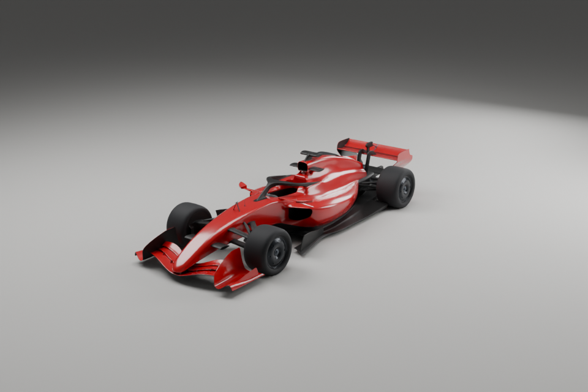

# Laboratório 3D INTEIA

> **INTEIA fixa na peça:** uso e adaptação dos modelos conforme [ASSET-LICENSE.txt](ASSET-LICENSE.txt). Somente a marca/patrocínio INTEIA deve permanecer; os demais podem ser alterados. Licenças já concedidas às versões anteriores continuam válidas.

## Baixar e reutilizar

Código e documentação: MIT. Para reutilização dos modelos sob os termos atuais, mantenha somente a marca/patrocínio **INTEIA visível e legível na própria peça**; os demais patrocínios podem ser removidos ou trocados. Uso, adaptação, redistribuição e uso comercial continuam permitidos. Consulte a licença de modelos `ASSET-LICENSE.txt` na raiz do repositório. As permissões MIT/CC BY 4.0 já concedidas às versões anteriores permanecem válidas.

[Guia de assets e reutilização](REUTILIZACAO.md) · [Licença MIT](LICENSE) · [Baixar ZIP sem conta](https://github.com/igormorais123/INTEIA-laboratorio-3d/archive/refs/heads/main.zip)

Um laboratório interativo para explorar e personalizar um carro de fórmula: 97 componentes exteriores, motor V6 ilustrativo integrado, patrocínios do F1 Loop, cores independentes, materiais, iluminação e movimentos ilustrativos. Inclui projeto Blender editável e modelos GLB para reutilização.

**[Abrir o laboratório oficial](https://laboratorio-3d-inteia.igor47306.chatgpt.site)** · **[Documentação](docs/README.md)** · **[Atlas detalhado](docs/mapeamento-detalhado/index.html)**



## Comece aqui

Comece pelo **[índice canônico da documentação](docs/README.md)**. Para busca estrutural, use o [atlas do código, documentos e assets](docs/mapas/README.md), com arquivos, peças e grafos verificáveis. Para a busca offline, baixe o repositório e abra [docs/mapas/index.html](docs/mapas/index.html).

| Quero… | Abra / leia |
| --- | --- |
| Explorar e trocar cores | [Laboratório oficial](https://laboratorio-3d-inteia.igor47306.chatgpt.site) ou [HTML para uso local](web/index.html) |
| Editar o modelo | [INTEIA_F1_Master.blend](INTEIA_F1_Master.blend) no Blender 4.5 |
| Usar a identidade visual | [Marca e variantes SVG](identidade/LEIA-ME.md) |
| Explorar o box-laboratório | [Guia do ambiente](docs/BOX-LABORATORIO.md) · [Box GLB](ambientes/INTEIA-box-laboratorio.glb) · [Blender com carro](ambientes/INTEIA_Box_com_carro.blend) |
| Importar apenas o carro | [GLB estático](modelos/INTEIA_F1_estatico.glb) |
| Reproduzir a demonstração | [GLB animado](modelos/INTEIA_F1_animado.glb) |
| Desenvolver o site | [Desenvolvimento](docs/DESENVOLVIMENTO.md) |
| Gerar e calibrar o som dos motores V12 e V6 | [Estúdio de som](docs/ESTUDIO-SOM.md) |
| Trocar pneus, asas e arrefecimento por cenário de pista | [Peças sobressalentes do Box](docs/SOBRESSALENTES.md) |
| Entender ou produzir os sistemas internos | [Sistemas internos em 3D](docs/SISTEMAS-3D.md) · [Especificação histórica](docs/ESPECIFICACAO-ASSET-3D-SISTEMAS-F1.md) |
| Usar partes em outro Blender | [Guia Blender](docs/BLENDER.md) |
| Integrar em sites ou jogos | [Integração](docs/INTEGRACAO.md) |
| Entender os arquivos e materiais | [Arquitetura](docs/ARQUITETURA.md) |
| Fazer ensaios por coeficientes | [Túnel de vento](docs/AERODINAMICA.md) |
| Conferir testes e limitações | [Validação](docs/VALIDACAO.md) |

## Download e execução

Para continuar o trabalho em outra máquina, siga o [guia de instalação e sincronização entre PCs](docs/OUTRO-PC.md).

Clone ou use Code > Download ZIP. O HTML já está pronto e contém o carro final v2; o motor e as marcas são carregados de web/assets. Não requer conta nem chave de API.

```sh
git clone https://github.com/igormorais123/INTEIA-laboratorio-3d.git
cd INTEIA-laboratorio-3d/web
npm ci
npm run build
npm run dev
```

Abra http://127.0.0.1:5186 se essa for a porta livre usada por este servidor. Se já estiver ocupada, preserve o processo existente e escolha outra porta com `PORT`; veja [Desenvolvimento](docs/DESENVOLVIMENTO.md). Use o laboratório publicado ou o servidor local para carregar também o motor e os patrocínios. O link de um HTML dentro do GitHub mostra o código: ele não é um site publicado por si só.

## Atualização do carro e motor

O laboratório usa o mesmo carro v2, pintura final, rodas, piloto e patrocínios do F1 Loop: assinatura e brasão INTEIA, número 1 e Inteligência Mil Grau. Abra **MOTOR / V6 TURBO** para levantar a tampa, cortar a vista para mostrar os pistões e pausar/retomar. **Desmontar** mantém o motor visível dentro do conjunto. O túnel fecha a tampa automaticamente.

[Detalhes da integração](docs/INTEGRACAO-MOTOR.md).

## Bancadas de modelagem

As abas **Carro, Motor, Capacete, Piloto e Ambientes** organizam a oficina. O capacete detalhado de 1991 é compartilhado entre o carro e a bancada. O piloto tem corpo completo em postura reclinada, luvas com dedos, botas, costuras e cintos. As bancadas de capacete e piloto permitem alternar entre inspeção isolada e encaixe no cockpit e baixar GLB. Ajustes de altura, avanço e inclinação do capacete ficam na sessão e são incluídos ao exportar o piloto.

[Referências e limites do estudo](docs/PILOTO-E-CAPACETE.md).

## O que está incluído

- 97 componentes exteriores, separados e nomeados, com metadados de origem.
- Montagem/desmontagem, seleção, isolamento e deslocamento de peças.
- Giro das rodas, direção dianteira e DRS ilustrativos.
- Cores para carroceria, asas, rodas e carbono; quatro acabamentos de pintura.
- Estúdio claro/escuro, luz, piso, fundo e exportação de imagem.
- Túnel de vento didático com vento relativo, forças por coeficientes, gráfico e CSV. Não é CFD da geometria.
- Blender com texturas incorporadas, coleção reutilizável e estúdio separado.
- GLBs estático e animado, fontes web, scripts de conversão e evidências de validação.

As escolhas de personalização ficam na sessão do navegador. Use Salvar imagem para guardar uma imagem do design. O .blend distribuído contém o visual vermelho padrão, não escolhas posteriores feitas no navegador.

## Limites e direitos

É uma representação das peças externas fornecidas, com cerca de 260 mil triângulos no carro v2, além do motor e dos detalhes adicionais. Os sistemas internos são modelos didáticos em evolução; não constituem projeto de engenharia homologado. Não há rig físico nem colisores completos. Os arquivos Blender e GLB da pasta `modelos` continuam sendo a entrega original; mudanças do laboratório web ou dos geradores de sistemas não os substituem automaticamente. Os movimentos são ilustrativos; o projeto não foi certificado como réplica técnica nem como indistinguível de uma fotografia.

Código e documentação: [MIT](LICENSE). Modelos: [licença com preservação da marca INTEIA](ASSET-LICENSE.txt). Consulte [Direitos e procedência](docs/DIREITOS-E-PROCEDENCIA.md) e [THIRD-PARTY-NOTICES.md](THIRD-PARTY-NOTICES.md) para os materiais de terceiros.
