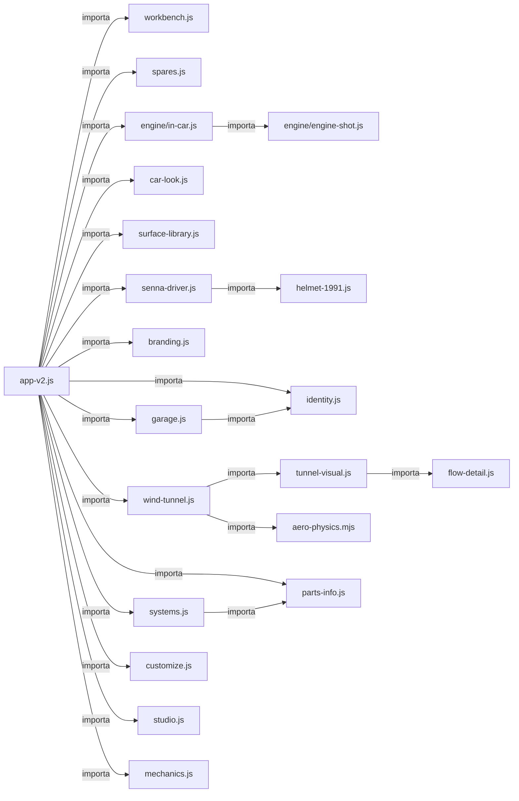
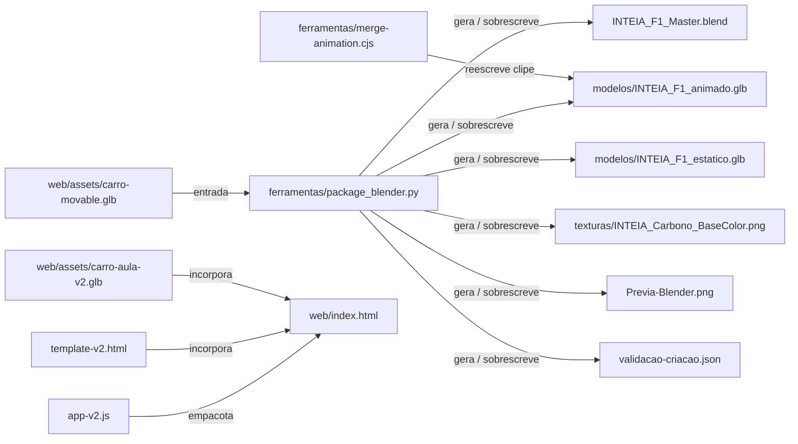
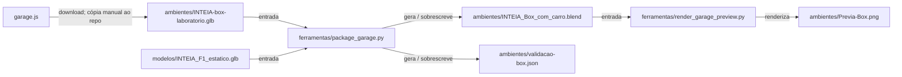

# Grafos verificáveis

[Índice](README.md) · [Explorar no navegador](index.html) · [Dados e evidências](dependencias.json)

Setas de dependência vão do importador ao módulo importado. Setas de produção vão da entrada à ferramenta ou entrega. Cada aresta abaixo tem evidência; a análise semântica complementar está em [graphify](../../graphify-out/GRAPH_REPORT.md).

## Arquitetura dos módulos web

`branding.js` integra a árvore de imports de `app-v2.js`. Dependências externas constam nos dados e na busca.

## Produção do carro

## Produção do box

O download do box é uma etapa humana: o grafo descreve o produtor, sem certificar que o GLB salvo foi exportado do código atual. O original `F1_2026_tutorial_part7_textures.blend` e a etapa inicial de separação não estão disponíveis no repositório.

## Evidências das relações

| Origem | Relação | Destino | Evidência |
| --- | --- | --- | --- |
| `docs/mapeamento-detalhado/scripts/verificar-app.mjs` | importa | `external:node:fs` | [docs/mapeamento-detalhado/scripts/verificar-app.mjs:2](../../docs/mapeamento-detalhado/scripts/verificar-app.mjs#L2) |
| `docs/mapeamento-detalhado/scripts/verificar-app.mjs` | importa | `external:node:path` | [docs/mapeamento-detalhado/scripts/verificar-app.mjs:3](../../docs/mapeamento-detalhado/scripts/verificar-app.mjs#L3) |
| `docs/mapeamento-detalhado/scripts/verificar-app.mjs` | importa | `external:node:crypto` | [docs/mapeamento-detalhado/scripts/verificar-app.mjs:4](../../docs/mapeamento-detalhado/scripts/verificar-app.mjs#L4) |
| `docs/mapeamento-detalhado/scripts/verificar-app.mjs` | importa | `external:node:url` | [docs/mapeamento-detalhado/scripts/verificar-app.mjs:5](../../docs/mapeamento-detalhado/scripts/verificar-app.mjs#L5) |
| `docs/mapeamento-detalhado/scripts/verificar-app.mjs` | importa | `external:node:module` | [docs/mapeamento-detalhado/scripts/verificar-app.mjs:6](../../docs/mapeamento-detalhado/scripts/verificar-app.mjs#L6) |
| `docs/mapeamento-detalhado/scripts/verificar-app.mjs` | importa | `external:node:child_process` | [docs/mapeamento-detalhado/scripts/verificar-app.mjs:7](../../docs/mapeamento-detalhado/scripts/verificar-app.mjs#L7) |
| `docs/mapeamento-detalhado/scripts/verificar-app.mjs` | importa | `external:esbuild` | [docs/mapeamento-detalhado/scripts/verificar-app.mjs:10](../../docs/mapeamento-detalhado/scripts/verificar-app.mjs#L10) |
| `ferramentas/manifest.cjs` | importa | `external:fs` | [ferramentas/manifest.cjs:1](../../ferramentas/manifest.cjs#L1) |
| `ferramentas/manifest.cjs` | importa | `external:path` | [ferramentas/manifest.cjs:1](../../ferramentas/manifest.cjs#L1) |
| `ferramentas/manifest.cjs` | importa | `external:crypto` | [ferramentas/manifest.cjs:1](../../ferramentas/manifest.cjs#L1) |
| `ferramentas/merge-animation.cjs` | importa | `external:fs` | [ferramentas/merge-animation.cjs:1](../../ferramentas/merge-animation.cjs#L1) |
| `ferramentas/merge-animation.cjs` | importa | `external:path` | [ferramentas/merge-animation.cjs:1](../../ferramentas/merge-animation.cjs#L1) |
| `ferramentas/otimizar_sistemas.mjs` | importa | `external:node:crypto` | [ferramentas/otimizar_sistemas.mjs:2](../../ferramentas/otimizar_sistemas.mjs#L2) |
| `ferramentas/otimizar_sistemas.mjs` | importa | `external:node:fs` | [ferramentas/otimizar_sistemas.mjs:3](../../ferramentas/otimizar_sistemas.mjs#L3) |
| `ferramentas/otimizar_sistemas.mjs` | importa | `external:node:path` | [ferramentas/otimizar_sistemas.mjs:4](../../ferramentas/otimizar_sistemas.mjs#L4) |
| `ferramentas/otimizar_sistemas.mjs` | importa | `external:node:module` | [ferramentas/otimizar_sistemas.mjs:5](../../ferramentas/otimizar_sistemas.mjs#L5) |
| `ferramentas/otimizar_sistemas.mjs` | importa | `external:node:url` | [ferramentas/otimizar_sistemas.mjs:6](../../ferramentas/otimizar_sistemas.mjs#L6) |
| `web/build.cjs` | importa | `external:node:fs` | [web/build.cjs:1](../../web/build.cjs#L1) |
| `web/build.cjs` | importa | `external:node:path` | [web/build.cjs:2](../../web/build.cjs#L2) |
| `web/build.cjs` | importa | `external:esbuild` | [web/build.cjs:3](../../web/build.cjs#L3) |
| `web/server.cjs` | importa | `external:node:fs` | [web/server.cjs:1](../../web/server.cjs#L1) |
| `web/server.cjs` | importa | `external:node:http` | [web/server.cjs:2](../../web/server.cjs#L2) |
| `web/server.cjs` | importa | `external:node:path` | [web/server.cjs:3](../../web/server.cjs#L3) |
| `web/src/app-v2.js` | importa | `web/src/workbench.js` | [web/src/app-v2.js:1](../../web/src/app-v2.js#L1) |
| `web/src/app-v2.js` | importa | `web/src/spares.js` | [web/src/app-v2.js:2](../../web/src/app-v2.js#L2) |
| `web/src/app-v2.js` | importa | `external:three/addons/libs/meshopt_decoder.module.js` | [web/src/app-v2.js:3](../../web/src/app-v2.js#L3) |
| `web/src/app-v2.js` | importa | `web/src/engine/in-car.js` | [web/src/app-v2.js:4](../../web/src/app-v2.js#L4) |
| `web/src/app-v2.js` | importa | `web/src/car-look.js` | [web/src/app-v2.js:5](../../web/src/app-v2.js#L5) |
| `web/src/app-v2.js` | importa | `web/src/surface-library.js` | [web/src/app-v2.js:6](../../web/src/app-v2.js#L6) |
| `web/src/app-v2.js` | importa | `web/src/senna-driver.js` | [web/src/app-v2.js:7](../../web/src/app-v2.js#L7) |
| `web/src/app-v2.js` | importa | `web/src/branding.js` | [web/src/app-v2.js:8](../../web/src/app-v2.js#L8) |
| `web/src/app-v2.js` | importa | `web/src/identity.js` | [web/src/app-v2.js:9](../../web/src/app-v2.js#L9) |
| `web/src/app-v2.js` | importa | `external:three/addons/exporters/GLTFExporter.js` | [web/src/app-v2.js:10](../../web/src/app-v2.js#L10) |
| `web/src/app-v2.js` | importa | `web/src/garage.js` | [web/src/app-v2.js:11](../../web/src/app-v2.js#L11) |
| `web/src/app-v2.js` | importa | `web/src/wind-tunnel.js` | [web/src/app-v2.js:12](../../web/src/app-v2.js#L12) |
| `web/src/app-v2.js` | importa | `web/src/parts-info.js` | [web/src/app-v2.js:13](../../web/src/app-v2.js#L13) |
| `web/src/app-v2.js` | importa | `web/src/systems.js` | [web/src/app-v2.js:14](../../web/src/app-v2.js#L14) |
| `web/src/app-v2.js` | importa | `web/src/customize.js` | [web/src/app-v2.js:15](../../web/src/app-v2.js#L15) |
| `web/src/app-v2.js` | importa | `external:three` | [web/src/app-v2.js:16](../../web/src/app-v2.js#L16) |
| `web/src/app-v2.js` | importa | `external:three/addons/controls/OrbitControls.js` | [web/src/app-v2.js:17](../../web/src/app-v2.js#L17) |
| `web/src/app-v2.js` | importa | `external:three/addons/controls/TransformControls.js` | [web/src/app-v2.js:18](../../web/src/app-v2.js#L18) |
| `web/src/app-v2.js` | importa | `external:three/addons/postprocessing/EffectComposer.js` | [web/src/app-v2.js:19](../../web/src/app-v2.js#L19) |
| `web/src/app-v2.js` | importa | `external:three/addons/postprocessing/RenderPass.js` | [web/src/app-v2.js:20](../../web/src/app-v2.js#L20) |
| `web/src/app-v2.js` | importa | `external:three/addons/postprocessing/SSAOPass.js` | [web/src/app-v2.js:21](../../web/src/app-v2.js#L21) |
| `web/src/app-v2.js` | importa | `external:three/addons/postprocessing/OutputPass.js` | [web/src/app-v2.js:22](../../web/src/app-v2.js#L22) |
| `web/src/app-v2.js` | importa | `external:three/addons/postprocessing/SMAAPass.js` | [web/src/app-v2.js:23](../../web/src/app-v2.js#L23) |
| `web/src/app-v2.js` | importa | `external:three/addons/loaders/GLTFLoader.js` | [web/src/app-v2.js:24](../../web/src/app-v2.js#L24) |
| `web/src/app-v2.js` | importa | `web/src/studio.js` | [web/src/app-v2.js:25](../../web/src/app-v2.js#L25) |
| `web/src/app-v2.js` | importa | `web/src/mechanics.js` | [web/src/app-v2.js:26](../../web/src/app-v2.js#L26) |
| `web/src/branding.js` | importa | `external:three` | [web/src/branding.js:1](../../web/src/branding.js#L1) |
| `web/src/branding.js` | importa | `external:three/addons/geometries/DecalGeometry.js` | [web/src/branding.js:2](../../web/src/branding.js#L2) |
| `web/src/car-look.js` | importa | `external:three` | [web/src/car-look.js:6](../../web/src/car-look.js#L6) |
| `web/src/engine/in-car.js` | importa | `external:three` | [web/src/engine/in-car.js:1](../../web/src/engine/in-car.js#L1) |
| `web/src/engine/in-car.js` | importa | `external:three/addons/loaders/GLTFLoader.js` | [web/src/engine/in-car.js:2](../../web/src/engine/in-car.js#L2) |
| `web/src/engine/in-car.js` | importa | `external:three/addons/libs/meshopt_decoder.module.js` | [web/src/engine/in-car.js:3](../../web/src/engine/in-car.js#L3) |
| `web/src/engine/in-car.js` | importa | `web/src/engine/engine-shot.js` | [web/src/engine/in-car.js:4](../../web/src/engine/in-car.js#L4) |
| `web/src/flow-detail.js` | importa | `external:three` | [web/src/flow-detail.js:1](../../web/src/flow-detail.js#L1) |
| `web/src/garage.js` | importa | `external:three/addons/lights/RectAreaLightUniformsLib.js` | [web/src/garage.js:1](../../web/src/garage.js#L1) |
| `web/src/garage.js` | importa | `web/src/identity.js` | [web/src/garage.js:2](../../web/src/garage.js#L2) |
| `web/src/garage.js` | importa | `external:three` | [web/src/garage.js:3](../../web/src/garage.js#L3) |
| `web/src/garage.js` | importa | `external:three/addons/geometries/RoundedBoxGeometry.js` | [web/src/garage.js:4](../../web/src/garage.js#L4) |
| `web/src/helmet-1991.js` | importa | `external:three` | [web/src/helmet-1991.js:1](../../web/src/helmet-1991.js#L1) |
| `web/src/mechanics.js` | importa | `external:three` | [web/src/mechanics.js:1](../../web/src/mechanics.js#L1) |
| `web/src/senna-driver.js` | importa | `external:three` | [web/src/senna-driver.js:1](../../web/src/senna-driver.js#L1) |
| `web/src/senna-driver.js` | importa | `external:three/addons/geometries/RoundedBoxGeometry.js` | [web/src/senna-driver.js:2](../../web/src/senna-driver.js#L2) |
| `web/src/senna-driver.js` | importa | `web/src/helmet-1991.js` | [web/src/senna-driver.js:3](../../web/src/senna-driver.js#L3) |
| `web/src/spares.js` | importa | `external:three` | [web/src/spares.js:1](../../web/src/spares.js#L1) |
| `web/src/spares.js` | importa | `external:three/addons/loaders/GLTFLoader.js` | [web/src/spares.js:2](../../web/src/spares.js#L2) |
| `web/src/systems.js` | importa | `external:three` | [web/src/systems.js:1](../../web/src/systems.js#L1) |
| `web/src/systems.js` | importa | `web/src/parts-info.js` | [web/src/systems.js:2](../../web/src/systems.js#L2) |
| `web/src/systems.js` | importa | `external:three/addons/loaders/GLTFLoader.js` | [web/src/systems.js:3](../../web/src/systems.js#L3) |
| `web/src/systems.js` | importa | `external:three/addons/libs/meshopt_decoder.module.js` | [web/src/systems.js:4](../../web/src/systems.js#L4) |
| `web/src/tunnel-visual.js` | importa | `web/src/flow-detail.js` | [web/src/tunnel-visual.js:1](../../web/src/tunnel-visual.js#L1) |
| `web/src/tunnel-visual.js` | importa | `external:three` | [web/src/tunnel-visual.js:2](../../web/src/tunnel-visual.js#L2) |
| `web/src/wind-tunnel.js` | importa | `web/src/tunnel-visual.js` | [web/src/wind-tunnel.js:1](../../web/src/wind-tunnel.js#L1) |
| `web/src/wind-tunnel.js` | importa | `external:three` | [web/src/wind-tunnel.js:2](../../web/src/wind-tunnel.js#L2) |
| `web/src/wind-tunnel.js` | importa | `web/src/aero-physics.mjs` | [web/src/wind-tunnel.js:3](../../web/src/wind-tunnel.js#L3) |
| `web/src/workbench.js` | importa | `external:three` | [web/src/workbench.js:1](../../web/src/workbench.js#L1) |
| `web/src/workbench.js` | importa | `external:three/addons/exporters/GLTFExporter.js` | [web/src/workbench.js:2](../../web/src/workbench.js#L2) |
| `web/test-aerodynamics.mjs` | importa | `external:node:assert/strict` | [web/test-aerodynamics.mjs:1](../../web/test-aerodynamics.mjs#L1) |
| `web/test-aerodynamics.mjs` | importa | `web/src/aero-physics.mjs` | [web/test-aerodynamics.mjs:2](../../web/test-aerodynamics.mjs#L2) |
| `web/test-driver-model.mjs` | importa | `external:node:assert/strict` | [web/test-driver-model.mjs:1](../../web/test-driver-model.mjs#L1) |
| `web/test-driver-model.mjs` | importa | `external:three` | [web/test-driver-model.mjs:2](../../web/test-driver-model.mjs#L2) |
| `web/test-driver-model.mjs` | importa | `web/src/senna-driver.js` | [web/test-driver-model.mjs:3](../../web/test-driver-model.mjs#L3) |
| `web/test-mechanics.mjs` | importa | `external:three/addons/libs/meshopt_decoder.module.js` | [web/test-mechanics.mjs:1](../../web/test-mechanics.mjs#L1) |
| `web/test-mechanics.mjs` | importa | `external:node:fs` | [web/test-mechanics.mjs:2](../../web/test-mechanics.mjs#L2) |
| `web/test-mechanics.mjs` | importa | `external:three` | [web/test-mechanics.mjs:3](../../web/test-mechanics.mjs#L3) |
| `web/test-mechanics.mjs` | importa | `external:three/addons/loaders/GLTFLoader.js` | [web/test-mechanics.mjs:4](../../web/test-mechanics.mjs#L4) |
| `web/test-mechanics.mjs` | importa | `web/src/mechanics.js` | [web/test-mechanics.mjs:5](../../web/test-mechanics.mjs#L5) |
| `web/test-power-unit.mjs` | importa | `external:three/addons/libs/meshopt_decoder.module.js` | [web/test-power-unit.mjs:1](../../web/test-power-unit.mjs#L1) |
| `web/test-power-unit.mjs` | importa | `external:node:fs` | [web/test-power-unit.mjs:2](../../web/test-power-unit.mjs#L2) |
| `web/test-power-unit.mjs` | importa | `external:three` | [web/test-power-unit.mjs:3](../../web/test-power-unit.mjs#L3) |
| `web/test-power-unit.mjs` | importa | `external:three/addons/loaders/GLTFLoader.js` | [web/test-power-unit.mjs:4](../../web/test-power-unit.mjs#L4) |
| `web/test-spares.mjs` | importa | `external:node:assert/strict` | [web/test-spares.mjs:1](../../web/test-spares.mjs#L1) |
| `web/test-spares.mjs` | importa | `external:node:crypto` | [web/test-spares.mjs:2](../../web/test-spares.mjs#L2) |
| `web/test-spares.mjs` | importa | `external:node:fs` | [web/test-spares.mjs:3](../../web/test-spares.mjs#L3) |
| `web/test-spares.mjs` | importa | `web/src/spares.js` | [web/test-spares.mjs:4](../../web/test-spares.mjs#L4) |
| `web/test-systems.mjs` | importa | `external:node:assert/strict` | [web/test-systems.mjs:1](../../web/test-systems.mjs#L1) |
| `web/test-systems.mjs` | importa | `external:node:crypto` | [web/test-systems.mjs:2](../../web/test-systems.mjs#L2) |
| `web/test-systems.mjs` | importa | `external:node:fs` | [web/test-systems.mjs:3](../../web/test-systems.mjs#L3) |
| `web/test-systems.mjs` | importa | `external:three` | [web/test-systems.mjs:4](../../web/test-systems.mjs#L4) |
| `web/src/app-v2.js` | empacota | `web/index.html` | [web/build.cjs:18](../../web/build.cjs#L18) |
| `web/src/template-v2.html` | incorpora | `web/index.html` | [web/build.cjs:25](../../web/build.cjs#L25) |
| `web/assets/carro-aula-v2.glb` | incorpora | `web/index.html` | [web/build.cjs:26](../../web/build.cjs#L26) |
| `ferramentas/gerar_sistemas.py` | gera | `web/assets/sistemas-v1.glb` | [ferramentas/gerar_sistemas.py:149](../../ferramentas/gerar_sistemas.py#L149) |
| `ferramentas/otimizar_sistemas.mjs` | otimiza | `web/assets/sistemas-v1.glb` | [ferramentas/otimizar_sistemas.mjs:51](../../ferramentas/otimizar_sistemas.mjs#L51) |
| `ferramentas/gerar_sistemas.py` | escreve manifesto | `web/assets/sistemas-v1.manifest.json` | [ferramentas/gerar_sistemas.py:206](../../ferramentas/gerar_sistemas.py#L206) |
| `web/assets/sistemas-v1.glb` | carrega em runtime | `web/src/systems.js` | [web/src/systems.js:27](../../web/src/systems.js#L27) |
| `web/assets/carro-movable.glb` | entrada | `ferramentas/package_blender.py` | [ferramentas/package_blender.py:9](../../ferramentas/package_blender.py#L9) |
| `ferramentas/package_blender.py` | gera / sobrescreve | `INTEIA_F1_Master.blend` | [ferramentas/package_blender.py:145](../../ferramentas/package_blender.py#L145) |
| `ferramentas/package_blender.py` | gera / sobrescreve | `modelos/INTEIA_F1_estatico.glb` | [ferramentas/package_blender.py:126](../../ferramentas/package_blender.py#L126) |
| `ferramentas/package_blender.py` | gera / sobrescreve | `modelos/INTEIA_F1_animado.glb` | [ferramentas/package_blender.py:127](../../ferramentas/package_blender.py#L127) |
| `ferramentas/package_blender.py` | gera / sobrescreve | `texturas/INTEIA_Carbono_BaseColor.png` | [ferramentas/package_blender.py:44](../../ferramentas/package_blender.py#L44) |
| `ferramentas/package_blender.py` | gera / sobrescreve | `Previa-Blender.png` | [ferramentas/package_blender.py:146](../../ferramentas/package_blender.py#L146) |
| `ferramentas/package_blender.py` | gera / sobrescreve | `validacao-criacao.json` | [ferramentas/package_blender.py:148](../../ferramentas/package_blender.py#L148) |
| `ferramentas/merge-animation.cjs` | reescreve clipe | `modelos/INTEIA_F1_animado.glb` | [ferramentas/merge-animation.cjs:4](../../ferramentas/merge-animation.cjs#L4) |
| `web/src/garage.js` | download; cópia manual ao repo | `ambientes/INTEIA-box-laboratorio.glb` | [web/src/app-v2.js:96](../../web/src/app-v2.js#L96) |
| `ambientes/INTEIA-box-laboratorio.glb` | entrada | `ferramentas/package_garage.py` | [ferramentas/package_garage.py:6](../../ferramentas/package_garage.py#L6) |
| `modelos/INTEIA_F1_estatico.glb` | entrada | `ferramentas/package_garage.py` | [ferramentas/package_garage.py:12](../../ferramentas/package_garage.py#L12) |
| `ferramentas/package_garage.py` | gera / sobrescreve | `ambientes/INTEIA_Box_com_carro.blend` | [ferramentas/package_garage.py:72](../../ferramentas/package_garage.py#L72) |
| `ferramentas/package_garage.py` | gera / sobrescreve | `ambientes/validacao-box.json` | [ferramentas/package_garage.py:75](../../ferramentas/package_garage.py#L75) |
| `ambientes/INTEIA_Box_com_carro.blend` | entrada | `ferramentas/render_garage_preview.py` | [ferramentas/render_garage_preview.py:4](../../ferramentas/render_garage_preview.py#L4) |
| `ferramentas/render_garage_preview.py` | renderiza | `ambientes/Previa-Box.png` | [ferramentas/render_garage_preview.py:5](../../ferramentas/render_garage_preview.py#L5) |
| `INTEIA_F1_Master.blend` | reabre / verifica | `ferramentas/validate-kit.py` | [ferramentas/validate-kit.py:5](../../ferramentas/validate-kit.py#L5) |
| `modelos/INTEIA_F1_estatico.glb` | reabre / verifica | `ferramentas/validate-kit.py` | [ferramentas/validate-kit.py:15](../../ferramentas/validate-kit.py#L15) |
| `modelos/INTEIA_F1_animado.glb` | reabre / verifica | `ferramentas/validate-kit.py` | [ferramentas/validate-kit.py:15](../../ferramentas/validate-kit.py#L15) |
| `ferramentas/validate-kit.py` | escreve evidência | `validacao-reabertura.json` | [ferramentas/validate-kit.py:25](../../ferramentas/validate-kit.py#L25) |
| `web/test-mechanics.mjs` | escreve evidência | `validacao-mecanica-web.json` | [web/test-mechanics.mjs:24](../../web/test-mechanics.mjs#L24) |
| `INTEIA_F1_Master.blend` | mede hash | `ferramentas/manifest.cjs` | [ferramentas/manifest.cjs:1](../../ferramentas/manifest.cjs#L1) |
| `modelos/INTEIA_F1_estatico.glb` | mede hash | `ferramentas/manifest.cjs` | [ferramentas/manifest.cjs:1](../../ferramentas/manifest.cjs#L1) |
| `modelos/INTEIA_F1_animado.glb` | mede hash | `ferramentas/manifest.cjs` | [ferramentas/manifest.cjs:1](../../ferramentas/manifest.cjs#L1) |
| `texturas/INTEIA_Carbono_BaseColor.png` | mede hash | `ferramentas/manifest.cjs` | [ferramentas/manifest.cjs:1](../../ferramentas/manifest.cjs#L1) |
| `web/assets/carro-movable.glb` | mede hash | `ferramentas/manifest.cjs` | [ferramentas/manifest.cjs:1](../../ferramentas/manifest.cjs#L1) |
| `web/assets/carro-aula-v2.glb` | mede hash | `ferramentas/manifest.cjs` | [ferramentas/manifest.cjs:1](../../ferramentas/manifest.cjs#L1) |
| `web/assets/power-unit-v1.glb` | mede hash | `ferramentas/manifest.cjs` | [ferramentas/manifest.cjs:1](../../ferramentas/manifest.cjs#L1) |
| `web/assets/inteia-nome-oficial.svg` | mede hash | `ferramentas/manifest.cjs` | [ferramentas/manifest.cjs:1](../../ferramentas/manifest.cjs#L1) |
| `web/assets/inteia-escudo-oficial.svg` | mede hash | `ferramentas/manifest.cjs` | [ferramentas/manifest.cjs:1](../../ferramentas/manifest.cjs#L1) |
| `web/assets/inteligencia-mil-grau-transparent.png` | mede hash | `ferramentas/manifest.cjs` | [ferramentas/manifest.cjs:1](../../ferramentas/manifest.cjs#L1) |
| `web/index.html` | mede hash | `ferramentas/manifest.cjs` | [ferramentas/manifest.cjs:1](../../ferramentas/manifest.cjs#L1) |
| `Previa-Blender.png` | mede hash | `ferramentas/manifest.cjs` | [ferramentas/manifest.cjs:1](../../ferramentas/manifest.cjs#L1) |
| `ambientes/INTEIA-box-laboratorio.glb` | mede hash | `ferramentas/manifest.cjs` | [ferramentas/manifest.cjs:1](../../ferramentas/manifest.cjs#L1) |
| `ambientes/INTEIA_Box_com_carro.blend` | mede hash | `ferramentas/manifest.cjs` | [ferramentas/manifest.cjs:1](../../ferramentas/manifest.cjs#L1) |
| `ambientes/Previa-Box.png` | mede hash | `ferramentas/manifest.cjs` | [ferramentas/manifest.cjs:1](../../ferramentas/manifest.cjs#L1) |
| `identidade/INTEIA-principal.svg` | mede hash | `ferramentas/manifest.cjs` | [ferramentas/manifest.cjs:1](../../ferramentas/manifest.cjs#L1) |
| `identidade/INTEIA-negativo.svg` | mede hash | `ferramentas/manifest.cjs` | [ferramentas/manifest.cjs:1](../../ferramentas/manifest.cjs#L1) |
| `identidade/INTEIA-monocromatico.svg` | mede hash | `ferramentas/manifest.cjs` | [ferramentas/manifest.cjs:1](../../ferramentas/manifest.cjs#L1) |
| `identidade/INTEIA-simbolo.svg` | mede hash | `ferramentas/manifest.cjs` | [ferramentas/manifest.cjs:1](../../ferramentas/manifest.cjs#L1) |
| `ferramentas/manifest.cjs` | escreve hashes | `manifesto-sha256.json` | [ferramentas/manifest.cjs:1](../../ferramentas/manifest.cjs#L1) |
