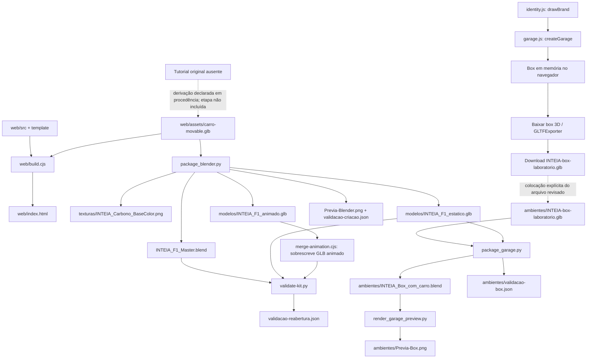

# Produção dos assets e entregas

[Voltar ao mapa](README.md) · [Guia de reaproveitamento](REUSO.md) · [Desenvolvimento](../DESENVOLVIMENTO.md)

Este mapa descreve relações verificadas inicialmente em `1ae4fd1`, com inventário e vínculos atualizados sobre `e3d58af`. A [revisão de acabamento e render](../ACABAMENTO-E-RENDER.md) acrescenta materiais e luzes ao box Blender e ao navegador; preserva o carro estático. A revisão posterior ativa a assinatura lateral no navegador. As setas abaixo representam leitura, transformação ou escrita explícita. Elas não afirmam que os scripts foram executados durante o mapeamento. Os relatórios históricos continuam sendo evidências das execuções que os produziram.

## Fontes, derivados e arquivos ausentes

| Classe | Arquivos | Responsabilidade |
| --- | --- | --- |
| Original de terceiro ausente | `F1_2026_tutorial_part7_textures.blend` | Citado em [procedência](../DIREITOS-E-PROCEDENCIA.md); não existe no repositório. A licença desse original não foi documentada. |
| Base geométrica derivada | [web/assets/carro-movable.glb](../../web/assets/carro-movable.glb) | Entrada concreta do build web e da reconstrução Blender; preserva dados usados para separar e controlar peças. Não é o original do tutorial. |
| Fontes web editáveis | [web/src](../../web/src), [build](../../web/build.cjs), [package.json](../../web/package.json) | Materiais, controles, box, túnel, interface e empacotamento. |
| Fonte editável entregue | [INTEIA_F1_Master.blend](../../INTEIA_F1_Master.blend) | Pode receber edição manual; foi gerado da base GLB. Reexecutar o gerador substitui essa edição. |
| Fonte procedural do box | [garage.js](../../web/src/garage.js) | Constrói o cenário em memória no navegador. O GLB é uma captura exportada dessa construção. |
| Fonte vetorial da marca em código | [identity.js](../../web/src/identity.js) | `glyphs`, `emblem`, `brandSVG`, `drawBrand`; interface e placa compartilham a definição. |
| Entregas da identidade | [SVGs e guia](../../identidade/LEIA-ME.md), [apresentação HTML](../../identidade/Identidade-INTEIA.html) | Arquivos vetoriais editáveis e apresentação portátil. Não há gerador destes arquivos documentado em `ferramentas`. |
| Entregas de modelos | [modelos](../../modelos), [ambientes](../../ambientes), [texturas](../../texturas) | GLBs, Blender do box, texturas e prévias; variam conforme o caminho de produção. |
| Entrega web gerada | [web/index.html](../../web/index.html) | HTML autossuficiente produzido a partir de código, template e GLB. |
| Metadados e evidências | [componentes-origem.json](../../documentacao/componentes-origem.json), [relatórios](../VALIDACAO.md), [manifesto](../../manifesto-sha256.json) | Proveniência, contagens/resultados registrados e hashes de uma lista de entregas. Não substituem as fontes. |
| História visual | [histórico das avaliações](../../documentacao/historico-avaliacoes.md), [comparação HTML](../../documentacao/Comparacao-iluminacao.html), [revisão do túnel](../REVISAO-TUNEL-VISUAL.md) | Avaliações de versões anteriores; não são QA automático das alterações futuras. A comparação mantém o nome histórico ROSSO. |

## Grafo do processo existente



O trecho pontilhado do tutorial registra uma origem documental; o código dessa conversão inicial não está neste repositório. O outro trecho pontilhado é uma ação de revisão/cópia entre o download e a pasta do projeto: o navegador não salva automaticamente sobre o GLB versionado.

## 1. Empacotar o site

[web/build.cjs](../../web/build.cjs), linhas 2–4, usa `src/app-v2.js` como entrada do esbuild, transforma os módulos em um IIFE minificado, lê `src/template-v2.html` e substitui `__MODEL__` pelo GLB em base64 e `__APP__` pelo pacote. A saída é `web/index.html`.

Execute a partir da raiz:

```powershell
npm --prefix web ci
npm --prefix web run build
npm --prefix web test
```

O prefixo importa: `build.cjs` resolve suas entradas pelo diretório de execução, enquanto os scripts npm são executados na pasta `web`. Rodar `node web/build.cjs` diretamente da raiz não é equivalente. [package.json](../../web/package.json) fixa Three.js `0.180.0` e esbuild `0.25.10`; o [lockfile](../../web/package-lock.json) registra a instalação.

No navegador, [app-v2.js](../../web/src/app-v2.js), linhas 45–51, lê `#model-data`, usa `GLTFLoader.parse`, centraliza o carro e inicializa materiais, personalização, mecânica, box e túnel. A aplicação constrói o box a partir de código; não carrega `ambientes/INTEIA-box-laboratorio.glb` para mostrar o cenário.

O endereço `127.0.0.1:5186` já está associado a uma pasta externa de entregas no ambiente de trabalho do autor. Não interrompa esse servidor para validar este repositório. Use uma porta livre configurada por `PORT`, conforme [Reuso web](REUSO.md#2-desenvolver-outra-experiência-a-partir-das-fontes), e confirme qual pasta o servidor usado realmente serve. O servidor deste repositório resolve a raiz por `__dirname` em [web/server.cjs](../../web/server.cjs).

## 2. Reconstruir o carro no Blender

[package_blender.py](../../ferramentas/package_blender.py) lê a base GLB, limpa a cena do processo Blender, preserva as malhas e as reúne em `INTEIA | Carro reutilizavel` sob a raiz `INTEIA_F1`. O script procura `sourceObject` específicos para pneus, rodas e `rear_wing_drs`; não é um conversor genérico de qualquer veículo. A reconstrução mantém transformações globais ao trocar pais, cria pivôs e verifica desvio da montagem antes do export.

Etapas explícitas no arquivo:

| Trecho | Operação |
| --- | --- |
| Linhas 4–26 | Resolve a raiz pelo script, importa `carro-movable.glb`, cria coleção/raiz e registra a origem e o limite ilustrativo dos movimentos. |
| Linhas 29–73 | Reconstrói materiais Principled, gera textura de carbono 256 × 256, cria UVs planares e empacota imagens da base. |
| Linhas 75–118 | Cria pivôs, keyframes e marcadores de montagem, rodas, direção e DRS. |
| Linhas 119–127 | Verifica montagem, seleciona coleção do carro e exporta GLBs estático e animado, preservando propriedades extras. |
| Linhas 128–145 | Cria estúdio separado, câmera e luzes; configura Cycles/AgX; empacota e salva o master. |
| Linhas 146–149 | Renderiza prévia e escreve `validacao-criacao.json`. |

Os GLBs são exportados antes de o estúdio ser criado. Assim, o piso, câmera e luzes desse estúdio não fazem parte dos GLBs de carro. Carbono portátil e iluminação Blender são adaptações; o shader web de projeção local não é exportado por esse processo.

O processo abaixo **substitui arquivos existentes**. Execute somente na cópia de trabalho escolhida para reconstrução, depois de preservar edições manuais e revisar a entrada:

```powershell
blender -b --python ferramentas/package_blender.py
node ferramentas/merge-animation.cjs
blender -b --python ferramentas/validate-kit.py
```

O executável `blender` deve estar disponível no ambiente, ou ser substituído por seu caminho. O gerador sempre usa a raiz onde seu próprio script está localizado; mudar apenas o diretório corrente não muda as saídas. Para reconstruir em uma cópia, use os scripts daquela cópia. Não execute o script do repositório original esperando que ele grave em outra pasta.

[merge-animation.cjs](../../ferramentas/merge-animation.cjs) lê o GLB animado e reúne seus canais/samplers em `INTEIA_Demonstracao_Montagem_Rodas_DRS`, ajustando os índices de sampler. Regrava o mesmo GLB. Não aplica a animação aos controles do site.

## 3. Exportar o box pelo navegador

`createGarage` em [garage.js](../../web/src/garage.js) constrói arquitetura, mobiliário e equipamentos, atribui `userData.section` aos objetos, cria telas por Canvas e atualiza a tela de configuração a partir de `mechanics`. Outras telas são cenográficas e indicam ausência de dados reais.

`getExportScene` (linha 144) clona somente a raiz do box e torna os objetos visíveis. Isso evita que uma parede temporariamente escondida pela posição da câmera desapareça do export. O carro pertence a outro ramo da cena e não integra esse grupo. O reflexo PMREM criado nas linhas 140–142 pertence à configuração de ambiente da cena, não ao grupo exportado.

O botão `#garage-export` em [app-v2.js](../../web/src/app-v2.js), linha 55, chama `GLTFExporter.parseAsync` com `binary: true` e `onlyVisible: false`, cria um Blob e inicia o download `INTEIA-box-laboratorio.glb`.

Para atualizar a entrega do box:

1. Construa o site e abra a versão correta em uma sessão conhecida. Confirme os materiais, telas e identidade esperados.
2. Acione **Baixar box 3D**. Registre onde o navegador salvou a cópia e confira que o download terminou.
3. Abra/reimporte o GLB em um destino de verificação. Confira objetos, materiais, imagens, luzes e ausência do carro nesse arquivo.
4. Preserve a entrega anterior. Só depois da revisão coloque o novo arquivo no caminho [ambientes/INTEIA-box-laboratorio.glb](../../ambientes/INTEIA-box-laboratorio.glb).
5. Reconstrua o Blender do box e a prévia se essas entregas também devam acompanhar a revisão; um build web não as atualiza.

As telas ficam estáticas no GLB. Atualizar a mecânica no navegador depois do download não altera o arquivo exportado. A regra de esconder paredes e a atualização das telas também não se tornam scripts funcionais no Blender/motor de destino.

## 4. Produzir o Blender do box e a prévia

[package_garage.py](../../ferramentas/package_garage.py) recebe o caminho do projeto após `--`, importa o GLB do ambiente, cria `INTEIA | BOX E EQUIPAMENTOS`, importa o GLB estático e cria `INTEIA | CARRO`. Calcula os limites do carro, centraliza-o no piso, ajusta a pintura e acrescenta luzes/câmera de renderização. Empacota imagens e grava o `.blend` e o relatório do box.

Na raiz da cópia escolhida:

```powershell
blender -b --python ferramentas/package_garage.py -- .
blender -b --python ferramentas/render_garage_preview.py -- .
```

O argumento `.` precisa ser a raiz do projeto onde entradas e saídas devem ser lidas/gravadas. Esses scripts também aceitam um caminho explícito. `package_garage.py` sobrescreve `ambientes/INTEIA_Box_com_carro.blend` e `ambientes/validacao-box.json`. A revisão gravada inclui a cena Cycles configurada com 64 amostras; [render_garage_preview.py](../../ferramentas/render_garage_preview.py) reabre o arquivo e gera `Previa-Box.png` em 1000 × 625, 16 amostras e denoising, sem salvar novamente a cena Blender.

O relatório do box é escrito durante a criação e lista malhas, limites do carro, imagens empacotadas e referências externas. O script de render reabre o `.blend`, mas não executa uma bateria de asserções nem produz um relatório de validação adicional. Inspecione a prévia e faça a conferência necessária à alteração.

## 5. Identidade e outros downloads

[identity.js](../../web/src/identity.js) mantém as letras e o emblema em curvas. `brandSVG` entrega a assinatura do cabeçalho; `drawBrand` desenha a placa usada pelo box. A apresentação HTML e os quatro SVGs em [identidade](../../identidade/LEIA-ME.md) são entregas separadas; modificar o código não os regrava automaticamente. Compare assinatura, destaque nas letras IA, proporções e cores entre os destinos depois de uma alteração.

[branding.js](../../web/src/branding.js) aplica uma assinatura lateral desde `e3d58af`, usando os glifos de `identity.js` em canvas e um decalque preso à carroceria. [web/assets/INTEIA-wordmark.svg](../../web/assets/INTEIA-wordmark.svg) permanece um arquivo adicional; nem esse decalque nem o cabeçalho criado por `brandSVG` carregam o SVG legado.

**Salvar imagem** gera `INTEIA-design-3D.png` em memória no navegador, ocultando temporariamente o seletor e o gizmo. **Exportar ensaio CSV** gera `INTEIA-ensaio-aerodinamico.csv` por [wind-tunnel.js](../../web/src/wind-tunnel.js). Esses downloads são resultados de uso e não entram automaticamente no Git nem no manifesto. Não existe neste pipeline exportação do túnel para Blender, vídeo ou cálculo CFD.

## 6. Validação e rastreabilidade

| Evidência / rotina | O que verifica | Limite |
| --- | --- | --- |
| [test-mechanics.mjs](../../web/test-mechanics.mjs) | Leitura da base, componentes, pivôs, ciclos, restauração e estados mecânicos. Escreve [validacao-mecanica-web.json](../../validacao-mecanica-web.json). | Não é validação física de suspensão nem revisão visual. |
| [test-aerodynamics.mjs](../../web/test-aerodynamics.mjs) | Unidades, equações, vento relativo e condições inválidas. | Valida a calculadora por coeficientes; não mede coeficientes do carro. |
| [validate-kit.py](../../ferramentas/validate-kit.py) | Reabre master, exige 97 componentes e 97 deslocados, checa erro de remontagem, imagens e reimportação de ambos os GLBs. | Escreve relatório; não testa motores de jogos. O código exige animação presente, mas não exige explicitamente 104 canais. |
| [validacao-criacao.json](../../validacao-criacao.json) | Dados reportados pelo gerador do master. | É saída de criação; a checagem de reabertura é separada. |
| [validacao-reabertura.json](../../validacao-reabertura.json) | Execução registrada: 97 peças, 752.823 triângulos, erro de remontagem zero, 104 canais no export animado. | Registro histórico até ser reexecutado com os assets escolhidos. |
| [validacao-box.json](../../ambientes/validacao-box.json) | Execução registrada: 568 malhas do box, 97 do carro, 12 imagens empacotadas e nenhuma externa. | Não contém uma revisão visual automática nem atesta edições posteriores. |
| [workflow verify.yml](../../.github/workflows/verify.yml) | Configura Node 24, instala dependências, faz build e testes web em push/PR. | Não abre navegador, não executa Blender nem verifica render de jogos. |
| [manifest.cjs](../../ferramentas/manifest.cjs) | Calcula bytes e SHA-256 de 14 caminhos explícitos e escreve [manifesto-sha256.json](../../manifesto-sha256.json). | Não é inventário completo do código/documentação e não comprova autoria, licença ou qualidade. |

Os documentos de validação registram 752.824 triângulos na base web e 752.823 na conversão Blender. A diferença de um triângulo já foi registrada; não afirme identidade topológica exata. O estado atual precisa ser conferido pela rotina apropriada ao arquivo alterado.

Depois de atualizar entregas finais, execute `node ferramentas/manifest.cjs` na cópia correta e confira o diff. O script usa sua própria localização para resolver a raiz, lê os 14 arquivos e regrava o manifesto. Mudanças só nos documentos/mapas não exigem fingir uma nova exportação de assets.

## O que precisa ser repetido após cada mudança

| Alteração | Entregas e verificações afetadas |
| --- | --- |
| Código/template web | Build e testes web; abrir HTML correto, verificar interação, teclado, movimento reduzido, tela estreita e aparência. Atualizar hash do HTML se a entrega mudar. |
| Geometria-base ou metadados | Mecânica e contagens web; reconstrução/reimportação Blender quando pretendida; revisar IDs/pivôs e entregas dependentes. |
| Master Blender manual | Salvar em arquivo preservado; exportar a partir do master editado, reimportar e testar. Não reexecutar o gerador sobre as edições por engano. |
| Box procedural | Build, revisão box/túnel/box, novo download GLB; revisar e atualizar Blender/prévia/relatório se essas entregas forem renovadas. |
| Marca | Comparar SVGs, HTML da identidade, cabeçalho e placa; reexportar box/Blender quando a marca dessas entregas mudar. |
| Equações do túnel | Testes físicos, entradas sem dados, exemplo hipotético, Mach, desmontagem/isolamento, gráfico/CSV e coerência das explicações. |
| Efeitos visuais do túnel | Revisão de fumaça, pausa, regiões, transparência/restauração e câmera; testes existentes e build. Não gerar alegações de CFD. |
| Novos arquivos/documentos | Regerar inventário/grafos e conferir cobertura, caminhos e símbolos pelo processo descrito no [índice dos mapas](README.md). |

Antes de versionar, confira os arquivos alterados e inclua somente as mudanças do trabalho em questão. Scripts de teste e exportação podem regravar relatórios e binários; uma execução bem-sucedida não autoriza incluir entregas não revisadas nem mudanças concorrentes.
