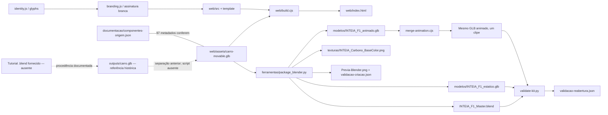
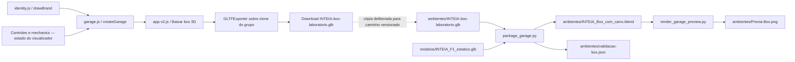

# Assets, produção e procedência

> **Autoria e licença atualizadas em 21/09/2026:** Conforme declaração de autoria de Igor Morais Vasconcelos em 21/09/2026, o vídeo foi usado como referência para as funções das peças; a modelagem disponibilizada é de sua autoria. A carroceria, suas versões GLB, o master Blender e os demais modelos autorais podem ser reutilizados conforme a licença de modelos na raiz do repositório, mantendo INTEIA na peça; as permissões das versões anteriores são preservadas. As descrições antigas de licença pendente da carroceria estão superadas; consulte os termos atuais de marca na licença de modelos. Os registros técnicos de conversão continuam preservados.

[Índice do mapeamento](README.md) · [Guia de reutilização](REUTILIZACAO.md)

Conferência atual: **2026-09-13T01:37:41Z**. Base Git: `HEAD` **`e3d58af3c59a87b308444e678b0b25803e00e727`**. A revisão inclui o acabamento final, a prévia concluída e a assinatura INTEIA sobre o carro web. As alterações locais remanescentes de documentação e mapeamento foram preservadas. Assinaturas dos arquivos usados constam no fim desta página. A análise leu somente o projeto INTEIA e não alterou aplicativo, modelos, imagens, manifesto ou relatórios de execução. Os fatos distinguem inspeção atual de bytes/metadados, leitura do código e registros de execuções anteriores.

## Como interpretar a evidência

- **Conferido no arquivo:** metadados extraídos do bloco JSON dos GLBs, tamanho de arquivo, nomes, imagens incorporadas, animações e hashes. Não exige abrir Blender.
- **Comprovado pelo código:** importação, geração, transformação e escrita aparecem no script referenciado. Isso comprova o comportamento implementado; a existência do script não significa que ele foi executado nesta análise.
- **Registrado anteriormente:** declarações de procedência, execuções Blender, inspeções visuais e contagens dos relatórios já versionados. Os `.blend` não foram reabertos nesta análise.
- **Inferência ou lacuna:** onde falta fonte original, script da etapa anterior ou validação do destino, a relação não é tratada como história reexecutada ou certificação técnica.

## Origem geométrica e contribuição INTEIA

[Direitos e procedência, linhas 9–11](../DIREITOS-E-PROCEDENCIA.md#L9) registra `F1_2026_tutorial_part7_textures.blend`, fornecido pelo usuário, como origem da geometria. **Esse arquivo de tutorial não está distribuído no repositório.** Também não há, entre as ferramentas distribuídas, o extrator/separador que executou a etapa inicial de conectividade. Por isso não é possível repetir a cadeia inteira partindo do tutorial apenas com estes arquivos.

O [registro de componentes](../../documentacao/componentes-origem.json#L2) conserva os caminhos históricos `outputs/carro.glb` → `outputs/carro-movable.glb`. São referências da produção anterior, não caminhos relativos disponíveis nesta cópia. A base distribuída é [web/assets/carro-movable.glb](../../web/assets/carro-movable.glb). Seus **97 nós de componente coincidem em nome e em todos os campos registrados com as 97 entradas de `parts`**. Esse confronto foi feito nesta análise.

A contribuição documentada do projeto inclui separação/identificação das peças, pivôs e metadados, materiais adaptados, lógica de montagem, visualizador e interface, personalização, identidade INTEIA, cenário procedural do box, representação visual do túnel e reconstrução de um master Blender reutilizável. A separação de uma geometria recebida não torna a modelagem original do carro uma criação integral do laboratório. A tabela por objeto adiante conserva essa distinção.

O master é reconstruído a partir do GLB separado: [package_blender.py, linha 9](../../ferramentas/package_blender.py#L9). Portanto é editável no Blender, mas não deve ser descrito como o `.blend` original do tutorial nem como arquivo que preserva sua pilha original de modificadores ([Arquitetura, linha 29](../ARQUITETURA.md#L29)).

## Inventário dos modelos conferidos

Contagens de triângulos são a soma das primitivas `mode=4`, usando `accessor(indices).count / 3` quando há índices e `accessor(POSITION).count / 3` quando não há. O box contém ambos os casos; contar apenas índices subestima sua geometria. Nós de cena e meshes são contagens diferentes.

| Asset | Bytes | Nós | Meshes | Materiais | Imagens internas | Triângulos | Animações |
| --- | ---: | ---: | ---: | ---: | ---: | ---: | --- |
| [Base web](../../web/assets/carro-movable.glb) | 26.454.116 | 138 | 97 | 21 | 11 | 752.824 | Nenhuma |
| [Carro estático](../../modelos/INTEIA_F1_estatico.glb) | 19.896.224 | 107 | 97 | 21 | 2 | 752.823 | Nenhuma |
| [Carro animado](../../modelos/INTEIA_F1_animado.glb) | 20.288.928 | 107 | 97 | 21 | 2 | 752.823 | Um clipe / 104 canais |
| [Box sem carro](../../ambientes/INTEIA-box-laboratorio.glb) | 10.302.288 | 581 | 568 | 39 | 11 | 128.860 | Nenhuma |

Os quatro arquivos são GLB/glTF 2.0, com imagens PNG em `bufferView`, sem URI externa de imagem. Os três GLBs do carro declaram o gerador `Khronos glTF Blender I/O v4.5.51`; o box declara `THREE.GLTFExporter r180`. O campo `generator` informa ferramenta/formato, não autoria ou licença da geometria.

O clipe se chama **INTEIA_Demonstracao_Montagem_Rodas_DRS**, tem 104 canais e seus accessors de tempo vão de aproximadamente **0,033333 s até 10 s**. O nome e os canais foram conferidos no arquivo animado. A diferença de um triângulo entre base web e conversão Blender é real e já consta em [Validação](../VALIDACAO.md#L10); não foi determinado aqui qual triângulo ou a causa dessa diferença. Não afirmar identidade topológica exata entre esses arquivos.

Os `.blend` têm 23.815.409 bytes (master) e 24.679.287 bytes (box + carro). Ambos correspondem ao manifesto final em bytes e SHA-256. O conteúdo interno, as coleções e o empacotamento de imagens são sustentados pelos scripts e relatórios existentes, não por uma nova inspeção Blender nesta rodada.

### Extensões e portabilidade

| Família | Extensões declaradas | Implicação verificável |
| --- | --- | --- |
| Três GLBs do carro | `KHR_materials_clearcoat` | Verniz depende de suporte do importador |
| Box | `KHR_texture_transform`, `EXT_materials_bump`, `KHR_materials_unlit`, `KHR_lights_punctual` | Transformação de textura, relevo, superfícies sem iluminação e luzes exigem avaliação no destino |

Não há promessa de equivalência visual em motores distintos. Em especial `EXT_materials_bump` deve ser conferida no importador escolhido. O box não inclui o ambiente PMREM da cena web: seu export clona apenas o grupo do cenário. Os scripts do Blender criam iluminação/câmeras próprias, e o carro exportado não inclui o estúdio.

## Fontes, derivados e arquivos editáveis

| Item | Natureza | Entrada/origem verificável | Uso e limites |
| --- | --- | --- | --- |
| [carro-movable.glb](../../web/assets/carro-movable.glb) | Derivado geométrico recebido como base local | Tutorial e separação inicial documentados; original não distribuído | Fonte operacional para web e reconstrução Blender; 97 partes com `extras` |
| [componentes-origem.json](../../documentacao/componentes-origem.json) | Registro derivado da separação | 41 objetos de origem, 97 componentes | Identificadores, categorias, limites, pivôs e validação inicial; nomes não são certificação mecânica |
| [web/src](../../web/src) | Fontes editáveis do laboratório | Código do projeto | Entrada `app-v2.js`, template, controles, shaders e ambientes |
| [web/index.html](../../web/index.html) | Derivado gerado e versionado | `build.cjs` + fontes + base GLB | HTML offline; alterações manuais perdem-se ao reconstruir |
| [INTEIA_F1_Master.blend](../../INTEIA_F1_Master.blend) | Derivado gerado que também é entrega editável | `package_blender.py` importa a base web | Carro, assets Blender, animação e estúdio; pode receber edições manuais que o gerador não preserva |
| [GLB estático](../../modelos/INTEIA_F1_estatico.glb) | Derivado de exportação | `package_blender.py` | Carro sem clipe, pivôs e materiais portáteis |
| [GLB animado](../../modelos/INTEIA_F1_animado.glb) | Derivado de exportação e pós-processamento | `package_blender.py` + `merge-animation.cjs` | Um clipe combinado; sem física de veículo |
| [Carbono PNG](../../texturas/INTEIA_Carbono_BaseColor.png) | Textura procedural gerada | Fórmula em `package_blender.py` | 256 × 256, portátil, UV planar; não é a implementação completa do shader web |
| [garage.js](../../web/src/garage.js) | Fonte procedural editável do ambiente | Código cria caixas, cilindros, tubos, CanvasTextures e luzes | Layout e equipamentos originais segundo documento do projeto; não réplica dimensional |
| [Box GLB](../../ambientes/INTEIA-box-laboratorio.glb) | Snapshot exportado do cenário | Botão em `app-v2.js` chama `garage.getExportScene()` | Sem carro; imagens de monitores estáticas |
| [Box + carro Blender](../../ambientes/INTEIA_Box_com_carro.blend) | Derivado editável combinado | `package_garage.py` importa box GLB e carro estático | Coleções distintas, carro recentralizado e pintura/luzes adaptadas |
| [Prévia Blender](../../Previa-Blender.png) | Render derivado | `package_blender.py` | Cycles/AgX; evidência visual, não fotografia |
| [Prévia do box](../../ambientes/Previa-Box.png) | Render derivado | `render_garage_preview.py` | Prévia final 1600 × 1000 / 2.189.120 bytes; script usa 64 amostras, cena mantém configuração de 128 |
| [identity.js](../../web/src/identity.js) | Desenho-fonte vetorial em código | `glyphs`, `emblem`, `brandSVG`, `drawBrand` | Identidade compartilhada por interface, placa do box e assinatura do carro |
| [SVGs de identidade](../../identidade/LEIA-ME.md) | Entregas vetoriais editáveis | Identidade original declarada do projeto | Principal, negativo, monocromático e símbolo; não há script de sincronização desses arquivos no build |
| [INTEIA-wordmark.svg](../../web/assets/INTEIA-wordmark.svg) | Asset vetorial adicional | Arquivo distribuído, sem referência na entrada atual | Não presumir uso por estar em `assets` |
| [branding.js](../../web/src/branding.js) | Fonte ativa da assinatura do carro | Importa `glyphs` de `identity.js`; Canvas + `DecalGeometry` | Chamada em `app-v2.js`; uma projeção na lateral direita de `main_body`, anexada à peça móvel; não altera os GLBs distribuídos |
| [manifesto-sha256.json](../../manifesto-sha256.json) | Registro gerado de integridade | Lista explícita de 14 caminhos em `manifest.cjs` | Cobertura parcial deliberada do kit, não inventário total |
| [documentacao](../../documentacao) | Registros, comparação HTML e capturas | Evidência anterior do desenvolvimento | Avaliações referem-se às versões descritas, não a toda edição posterior |

## Tabela completa da procedência por objeto do carro

Todas as linhas a seguir são **geometria derivada da fonte fornecida**, com organização/metadados e movimentação adaptados no projeto. A coluna `sourceObject` é proveniência registrada e conferida contra a base GLB; não identifica autor individual nem comprova função física de cada peça. Sufixos numéricos indicam componentes desconectados identificados na separação, e não números oficiais de peças.

Fonte: [componentes-origem.json](../../documentacao/componentes-origem.json). Cada `partId` abaixo existe no JSON e nos `extras` dos nós correspondentes da base. Para pivôs, `side`, `boundsMin`, `boundsMax`, rótulo e triângulos por parte, consulte esse JSON pesquisando o identificador exato.

| `sourceObject` registrado | Categoria | Partes | Todos os `partId` correspondentes |
| --- | --- | ---: | --- |
| `rear_wing_drs` | `aero` | 1 | `rear_wing_drs__01` |
| `rear_wing_main_part` | `aero` | 1 | `rear_wing_main_part__01` |
| `rear_wing_side` | `aero` | 2 | `rear_wing_side__01`, `rear_wing_side__02` |
| `rear_wing_top_mount` | `aero` | 2 | `rear_wing_top_mount__01`, `rear_wing_top_mount__02` |
| `rear_wing_holder` | `aero` | 2 | `rear_wing_holder__01`, `rear_wing_holder__02` |
| `rear_wing_bottom_holder` | `aero` | 1 | `rear_wing_bottom_holder__01` |
| `drs_holder` | `aero` | 1 | `drs_holder__01` |
| `drs_mechanism` | `aero` | 3 | `drs_mechanism__01`, `drs_mechanism__02`, `drs_mechanism__03` |
| `front_wing_side_plates` | `aero` | 4 | `front_wing_side_plates__01`, `front_wing_side_plates__02`, `front_wing_side_plates__03`, `front_wing_side_plates__04` |
| `front_wing_bottom` | `aero` | 1 | `front_wing_bottom__01` |
| `front_wing_middle` | `aero` | 1 | `front_wing_middle__01` |
| `front_wing_top` | `aero` | 1 | `front_wing_top__01` |
| `front_wing_mounts` | `aero` | 4 | `front_wing_mounts__01`, `front_wing_mounts__02`, `front_wing_mounts__03`, `front_wing_mounts__04` |
| `main_body` | `body` | 1 | `main_body__01` |
| `floor` | `aero` | 3 | `floor__01`, `floor__02`, `floor__03` |
| `rear_led` | `details` | 1 | `rear_led__01` |
| `exhaust` | `details` | 1 | `exhaust__01` |
| `top_intake_details` | `details` | 3 | `top_intake_details__01`, `top_intake_details__02`, `top_intake_details__03` |
| `antennas` | `details` | 4 | `antennas__01`, `antennas__02`, `antennas__03`, `antennas__04` |
| `side_mirrors` | `details` | 2 | `side_mirrors__L_01`, `side_mirrors__R_01` |
| `front_wing_mount` | `aero` | 2 | `front_wing_mount__01`, `front_wing_mount__02` |
| `main_body_inside` | `cockpit` | 2 | `main_body_inside__01`, `main_body_inside__02` |
| `main_body_glass` | `cockpit` | 1 | `main_body_glass__01` |
| `front_flap_detail` | `aero` | 2 | `front_flap_detail__01`, `front_flap_detail__02` |
| `front_wheel_cover` | `wheels` | 8 | `front_wheel_cover__L_01`, `front_wheel_cover__L_02`, `front_wheel_cover__L_03`, `front_wheel_cover__L_04`, `front_wheel_cover__R_01`, `front_wheel_cover__R_02`, `front_wheel_cover__R_03`, `front_wheel_cover__R_04` |
| `front_tire` | `wheels` | 2 | `front_tire__01`, `front_tire__02` |
| `inside_cover` | `wheels` | 2 | `inside_cover__01`, `inside_cover__02` |
| `rear_wheel_cover` | `wheels` | 8 | `rear_wheel_cover__L_01`, `rear_wheel_cover__L_02`, `rear_wheel_cover__L_03`, `rear_wheel_cover__L_04`, `rear_wheel_cover__R_01`, `rear_wheel_cover__R_02`, `rear_wheel_cover__R_03`, `rear_wheel_cover__R_04` |
| `rear_tire` | `wheels` | 2 | `rear_tire__01`, `rear_tire__02` |
| `rear_inside_cover` | `wheels` | 2 | `rear_inside_cover__01`, `rear_inside_cover__02` |
| `front_control_arms` | `suspension` | 4 | `front_control_arms__L_01`, `front_control_arms__L_02`, `front_control_arms__R_01`, `front_control_arms__R_02` |
| `front_pushrod` | `suspension` | 4 | `front_pushrod__L_01`, `front_pushrod__L_02`, `front_pushrod__R_01`, `front_pushrod__R_02` |
| `rear_control_arms` | `suspension` | 4 | `rear_control_arms__L_01`, `rear_control_arms__L_02`, `rear_control_arms__R_01`, `rear_control_arms__R_02` |
| `rear_driveshaft` | `suspension` | 6 | `rear_driveshaft__L_01`, `rear_driveshaft__L_02`, `rear_driveshaft__L_03`, `rear_driveshaft__R_01`, `rear_driveshaft__R_02`, `rear_driveshaft__R_03` |
| `new_rear_LED` | `details` | 1 | `new_rear_LED__01` |
| `lcd_screen` | `cockpit` | 1 | `lcd_screen__01` |
| `steering_wheel_buttons` | `cockpit` | 1 | `steering_wheel_buttons__01` |
| `steering_wheel_handles` | `cockpit` | 2 | `steering_wheel_handles__01`, `steering_wheel_handles__02` |
| `steering_wheel_leds` | `cockpit` | 1 | `steering_wheel_leds__01` |
| `steering_wheel_main` | `cockpit` | 1 | `steering_wheel_main__01` |
| `sw_connection` | `cockpit` | 2 | `sw_connection__01`, `sw_connection__02` |

Cobertura: **41 valores distintos de `sourceObject`, 97 partes, sem omissão ou duplicação de `partId`**. Distribuição: `aero` 31; `body` 1; `details` 12; `cockpit` 11; `wheels` 24; `suspension` 18. O `sourceNodes: 41` do registro é consistente com essas 41 origens; a base entregue contém 138 nós porque agrega os 41 agrupadores e os 97 componentes.

### Limites documentados da decomposição

O registro inicial declara preservação dos triângulos por material, materiais e imagens incorporadas, índices em faixa, erro máximo de limites por peça de `1,1920928955078125e-7` e arredondamento a `1e-6` apenas para consulta de conectividade. São resultados da etapa anterior; não foi reexecutada a separação porque sua entrada e seu script não estão neste kit. A conferência atual confirma os 97 metadados da base, sem reconstruir a comparação com o original ausente.

`main_body__01` continua uma casca externa conectada. Não se criaram painéis internos independentes completos. A documentação não estabelece power unit completo, internos da transmissão, banco do cockpit ou hidráulica funcional. Nomes como `drs_mechanism`, `rear_driveshaft` e `front_pushrod` são identificadores da fonte/organização; a sua presença visual não comprova um mecanismo calculado ou funcional.

## Materiais, texturas e identidade

### Carro web

[studio.js](../../web/src/studio.js) conserva a geometria recebida e ajusta a apresentação. Cria ambiente de reflexos com PMREM, luzes, piso, temas e materiais. A função interna `texture()` gera trama/ruído por Canvas; o shader do carbono usa projeção local em três planos (`onBeforeCompile` e `customProgramCacheKey`). Essas contribuições são de apresentação e não alteram a procedência da malha original.

A base GLB contém 21 materiais e 11 imagens PNG nomeadas: nove de pintura (`Pintura_rear_wing_drs`, `Pintura_rear_wing_main_part`, `Pintura_rear_wing_side`, `Pintura_front_wing_side_plates`, `Pintura_front_wing_bottom`, `Pintura_front_wing_middle`, `Pintura_front_wing_top`, `Pintura_main_body`, `Pintura_side_mirrors`), `web_texture_wheel` e `web_texture_steering_wheel`. Esses nomes descrevem o conteúdo encontrado; não bastam para resolver autor/licença de cada imagem de origem.

[customize.js, linhas 4–8](../../web/src/customize.js#L4) forma grupos pelo nome: `Pintura` sem `wing` → corpo; `Pintura` com `wing` → asas; `Rodas` → rodas; `carbon` → carbono. O grupo chamado carroceria pode incluir materiais pintados que não sejam literalmente a casca principal, conforme essa regra. Trocar nomes ou materiais exige revisar esse agrupamento.

### Carro Blender/GLB

[package_blender.py, linhas 27–73](../../ferramentas/package_blender.py#L27) converte cores para valores lineares, recria Principled BSDF por família, gera carbono PNG e UVs planares, marca assets e empacota imagens utilizadas. Os GLBs estático/animado contêm **duas imagens**: `INTEIA_Carbono_BaseColor` e `web_texture_steering_wheel`. O master também registra duas imagens empacotadas em [validacao-criacao.json](../../validacao-criacao.json).

Consequentemente, não se deve descrever a entrega portátil como cópia de todas as 11 imagens da base: o script troca materiais e os exports incorporam as imagens efetivamente referenciadas. A pintura vermelha padrão é `#ce0014` no gerador do carro; o box Blender ainda ajusta a pintura para seu ambiente. A identidade institucional vermelha `#D92135` é outra especificação, usada na marca. Não há validação colorimétrica oficial contra uma equipe.

### Box e monitores

[garage.js, linhas 13–19](../../web/src/garage.js#L13) constrói geometria por primitivas e superfícies procedurais. O código nomeia objetos por seção e serial e grava `userData.section`. Na exportação atual, 536 meshes têm seção e 32 meshes não têm esse campo. A ausência de seção não indica que o mesh é de terceiros: vários planos de telas/rótulos são construídos por funções que não atribuem essa propriedade.

| `section` no GLB | Meshes |
| --- | ---: |
| Architecture | 149 |
| Engineering workstation | 234 |
| Tool trolley | 51 |
| Tyre storage | 6 |
| Service jack | 7 |
| Overhead services | 50 |
| Technical storage | 30 |
| Tyre rack bracing | 9 |
| Sem `section` | 32 |

Os monitores são CanvasTextures. A tela de configuração usa a quantidade de componentes e os valores atuais de montagem, direção e DRS. As outras exibem plano cenográfico ou ausência de telemetria, conforme [garage.js, linhas 58–64](../../web/src/garage.js#L58). O monitor de configuração é redesenhado aproximadamente a cada segundo quando o box está ativo. O export congela esses pixels em imagens e não transporta a função de atualização.

O box GLB tem **11 imagens** incorporadas; a cena Blender combinada registra **12 imagens empacotadas** em [validacao-box.json](../../ambientes/validacao-box.json). São escopos diferentes, pois a cena combinada acrescenta o carro. O guia anterior relata 12 imagens ao discutir o conjunto; para interpretar o GLB isolado, use a contagem atual de 11.

[Box-laboratório](../BOX-LABORATORIO.md) declara o layout como interpretação original inspirada em referências públicas de boxes, sem usar fotografias como fundo e sem equivalência dimensional com instalação específica. Esta análise confirma a construção procedural no código; não auditou publicamente a licença de todas as referências externas mencionadas nesse documento.

### Identidade INTEIA

[identity.js](../../web/src/identity.js) define seis letras, com as duas finais `IA` em vermelho, e um emblema vetorial. `brandSVG()` preenche o cabeçalho em [app-v2.js, linha 19](../../web/src/app-v2.js#L19); `drawBrand()` desenha a placa do box em [garage.js, linha 37](../../web/src/garage.js#L37). Essa relação é comprovada por importações/chamadas.

As variantes prontas estão em [identidade/LEIA-ME.md](../../identidade/LEIA-ME.md). O guia declara desenho original, proporção preservada, margem em torno da marca, fonte auxiliar Arial, vermelho `#D92135`, grafite `#202930`, branco `#F0F2F3`. A aplicação atual também chama [applyInteiaBranding](../../web/src/app-v2.js#L49). [branding.js](../../web/src/branding.js#L1) importa `glyphs`, desenha as seis letras em branco e faz uma única projeção em `main_body`, a partir da lateral direita ([linha 27](../../web/src/branding.js#L27)). O decalque é anexado ao mesh atingido e acompanha seu movimento; não é uma peça adicional do catálogo de 97 componentes. A frase anterior do guia de identidade sobre o carro sem propaganda não descreve essa assinatura agora ativa. Não atribuir ao modelo um logo de equipe ou afiliação esportiva.

## Acabamento e assinatura na revisão final

[ACABAMENTO-E-RENDER.md](../ACABAMENTO-E-RENDER.md) registra a revisão incluída no estado final. O código atual sustenta os comportamentos abaixo; a leitura deste mapeamento não executou render nem modificou os assets:

- [studio.js](../../web/src/studio.js#L190) limpa mapas herdados da pintura, reduz sua rugosidade/verniz e altera resposta de carbono, pneus e aço. [customize.js](../../web/src/customize.js#L13) atualiza o acabamento brilhante para Roughness `0.21`/Coat Roughness `0.065`.
- [garage.js](../../web/src/garage.js#L138) inicializa `RectAreaLightUniformsLib`, cria duas luzes retangulares, desativa projeção de sombras pelos elementos superiores e muda os materiais do cenário. O clone usado para PMREM é deslocado em Y por `-0.75`, com suavização `0.012`. O GLB agora tem 581 nós, mantendo 568 meshes e 128.860 triângulos.
- [package_garage.py](../../ferramentas/package_garage.py#L24) ajusta pintura, acrescenta textura procedural de pneus e bevel apenas de sombreamento; remove **todas as luzes importadas** e cria cinco luzes de área. Configura Cycles com 128 amostras, denoising, limiar adaptativo `0.015`, câmera de 30 mm e saída 1600 × 1000.
- [render_garage_preview.py](../../ferramentas/render_garage_preview.py#L5) renderiza em **64 amostras/1600 × 1000** e limita seis threads. A configuração criada por `package_garage.py` continua em 128 amostras. A prévia final existe, possui **2.189.120 bytes**, dimensões **1600 × 1000** e corresponde ao manifesto final; o número de amostras é sustentado pelo script e pelo [registro de acabamento](../ACABAMENTO-E-RENDER.md#L9), não inferido dos pixels.
- [branding.js](../../web/src/branding.js#L27) cria a assinatura sobre `main_body` no navegador após a criação dos registros mecânicos. O mesh visual acrescentado não muda o arquivo-base de 97 peças; uma contagem de triângulos em toda a cena web pode incluir o decalque.

As luzes retangulares da cena Three.js e os shaders procedurais do Blender não são transportados integralmente pelo GLB. Os dois nós adicionais do box não significam duas novas meshes; a contagem geométrica foi medida separadamente. Todos os 14 artefatos do manifesto final conferem. O master, os dois exports do carro e a base web mantiveram os hashes da primeira leitura; o acabamento e a assinatura web são contribuições posteriores de apresentação. Não atribuir o novo acabamento do box ao export estático original sem refazê-lo deliberadamente.

## Grafos de produção com nível de evidência

Setas contínuas representam leitura/escrita comprovada pelo código atual. Setas pontilhadas representam procedência anterior documentada cuja etapa não pode ser repetida somente com esta cópia. Os gráficos não afirmam que todos os scripts foram executados no mapeamento.

O master não é lido automaticamente pelo build web. A exportação do box é uma ação da interface, não etapa de `npm run build`. O download não substitui automaticamente o asset versionado. Editar `garage.js` sem reconstruir o HTML, exportar o cenário e empacotar a cena não atualiza os `.glb`/`.blend` existentes. Essas fronteiras evitam reutilizar um derivado antigo acreditando que acompanha toda mudança da fonte.

## Scripts: entradas, saídas e risco de sobrescrita

| Script | Entrada | Saídas sobrescritas | Pré-requisito/observação |
| --- | --- | --- | --- |
| [web/build.cjs](../../web/build.cjs) | `web/src/app-v2.js`, imports, `template-v2.html`, base GLB | `web/index.html` | Node/esbuild; diretório corrente `web`, use `npm --prefix web run build` |
| [package_blender.py](../../ferramentas/package_blender.py) | Base GLB | Master, dois GLBs, carbono PNG, prévia e `validacao-criacao.json` | Blender/bpy; raiz derivada de `__file__`; reinicia cena; assume metadados específicos |
| [merge-animation.cjs](../../ferramentas/merge-animation.cjs) | GLB animado | Mesmo GLB animado | Node; concatena samplers/canais, ajusta índices e preserva bloco binário |
| [validate-kit.py](../../ferramentas/validate-kit.py) | Master e dois GLBs | `validacao-reabertura.json` | Blender; reimporta exports e verifica 97 meshes/animação/imagens |
| [package_garage.py](../../ferramentas/package_garage.py) | Box GLB e carro estático | Box + carro `.blend`, `ambientes/validacao-box.json` | Blender; recebe caminho da raiz após `--`; usa `.` a partir da raiz |
| [render_garage_preview.py](../../ferramentas/render_garage_preview.py) | Box + carro `.blend` | `ambientes/Previa-Box.png` | Blender; raiz após `--`; 64 amostras, 1600 × 1000, denoising, seis threads fixas |
| [manifest.cjs](../../ferramentas/manifest.cjs) | 14 arquivos explícitos | `manifesto-sha256.json` | Node; não descobre automaticamente novos assets |
| [web/test-mechanics.mjs](../../web/test-mechanics.mjs) | Base GLB e controlador mecânico | `validacao-mecanica-web.json` | npm executa em `web`; verifica ciclos/retorno/isolamento |

As receitas completas e os efeitos de cada comando estão em [Reutilização](REUTILIZACAO.md). Não se executou build, package, export, render ou regravação do manifesto nesta subtarefa de documentação.

## Integridade, evidências e lacunas

Na conferência **2026-09-13T01:37:41Z**, o manifesto continha **14 entradas, todas compatíveis simultaneamente em bytes e SHA-256**. Ele foi atualizado pela execução responsável pelos artefatos; esta análise apenas o leu e recalculou as assinaturas. O manifesto não cobre fontes, todos os documentos, todos os JSONs de validação, o wordmark adicional nem dependências. Uma mudança fora dessa lista não necessariamente altera o manifesto.

[validacao-criacao.json](../../validacao-criacao.json), [validacao-reabertura.json](../../validacao-reabertura.json), [validacao-mecanica-web.json](../../validacao-mecanica-web.json) e [validacao-box.json](../../ambientes/validacao-box.json) são relatórios anteriores, sem nova execução nesta análise. O histórico de avaliações em [documentacao/historico-avaliacoes.md](../../documentacao/historico-avaliacoes.md) e a [Comparação de iluminação](../../documentacao/Comparacao-iluminacao.html) contextualizam versões anteriores. Não usar uma aceitação visual histórica como verificação universal de alterações posteriores.

Lacunas concretas:

1. Tutorial original, licença de origem e script da separação inicial não estão distribuídos. Não é possível regenerar a base integralmente do original com este kit.
2. A licença das imagens/modelo de terceiros não foi disponibilizada/verificada segundo os avisos locais. Não atribuir direitos adicionais pelo simples fato de o repositório ser público.
3. Não há teste documentado nos motores Unity, Unreal ou Godot, nem LODs, colisores, versão low-poly ou dinâmica veicular completa.
4. Não há explicação comprovada nesta análise para a perda de um triângulo no export Blender. A diferença foi preservada e explicitada.
5. A aparência do shader web de carbono, PMREM e pós-processamento não é transportada integralmente por glTF. Importação bem-sucedida não comprova equivalência de imagem.
6. O box e túnel são representações visuais. Não são réplica dimensional, cenário homologado, telemetria real, CFD validada nem ensaio físico do carro.
7. Não há atualização automática dos assets exportados quando se muda a fonte web, nem sincronização do master a partir de personalizações da sessão.

## Licenças e atribuições documentadas

A [LICENSE](../../LICENSE) reserva à INTEIA os direitos sobre código original, interface, documentação e contribuições originais. A publicação do repositório não concede licença aberta ou autorização geral de uso/distribuição. A mesma licença distingue os direitos dos materiais de terceiros, que continuam sujeitos a seus próprios termos.

[THIRD-PARTY-NOTICES.md](../../THIRD-PARTY-NOTICES.md) registra Three.js `0.180.0` com licença MIT preservada em [web/THREE-LICENSE.txt](../../web/THREE-LICENSE.txt), esbuild `0.25.10` como ferramenta cuja licença acompanha o pacote e a licença não disponibilizada/verificada da geometria e imagens do tutorial. [DIREITOS-E-PROCEDENCIA.md](../DIREITOS-E-PROCEDENCIA.md) separa titularidade do projeto da origem de terceiros e declara ausência de afiliação/certificação por equipe ou organização esportiva.

Essas são declarações dos arquivos do repositório, não uma auditoria jurídica externa. Mantenha os avisos ao preparar um pacote e esclareça as permissões correspondentes antes da distribuição pretendida. Não substituir a licença desconhecida da origem pela licença do projeto nem pela licença MIT de uma biblioteca.

## Como refazer esta conferência

1. Registre `git rev-parse HEAD` e `git status --short` antes da leitura. Não integre alterações concorrentes por suposição.
2. Leia os quatro GLBs sem exportá-los: cabeçalho GLB, chunk JSON, arrays `nodes`, `meshes`, `materials`, `images`, `animations`, `accessors` e `extensionsUsed`.
3. Conte triângulos indexados e não indexados; se surgirem modos de primitivas diferentes de `4`, não aplique divisão por três indiscriminadamente.
4. Compare `partId`, nome e todos os campos do registro com os `extras` dos componentes da base. Registre acréscimos, ausências ou divergências.
5. Calcule bytes/SHA-256 dos caminhos já listados no manifesto, sem executar `manifest.cjs`, que o sobrescreve.
6. Confira as entradas/saídas dos scripts e importações atuais. Identifique como **histórico** aquilo que depende da etapa original ausente.
7. Atualize as tabelas e os grafos desta documentação; valide os links locais e preserve documentação concorrente. O processo geral de atualização está no [índice do mapeamento](README.md).

## Assinaturas da conferência

Leitura em **2026-09-13T01:37:41Z**, com `HEAD` **`e3d58af3c59a87b308444e678b0b25803e00e727`** e alterações locais remanescentes de documentação/mapeamento. SHA-256 dos bytes lidos; esta lista registra evidência e não substitui o manifesto do projeto.

| Caminho | SHA-256 |
| --- | --- |
| [README.md](../../README.md) | `74ac698c0eb3625ea0858b987f942c251581a7c037db907f172285b1582bb267` |
| [LEIA-ME.md](../../LEIA-ME.md) | `75cbe95607bffefab55565df52feb3317b2456ded5265f843dd93962cc89993d` |
| [docs/BLENDER.md](../../docs/BLENDER.md) | `2161c1fdfc3e7922b3c6ff298199d610117698b9a9c640d369dcdeefc192237c` |
| [docs/INTEGRACAO.md](../../docs/INTEGRACAO.md) | `cffcadec8f43e58aa260d28e712f7caca431bba7e54f47ddcf366bef4639f967` |
| [docs/DIREITOS-E-PROCEDENCIA.md](../../docs/DIREITOS-E-PROCEDENCIA.md) | `bb4df5145aee2a7db07f8cb7aff830658f83a9bc4438fdb86a69a35d789dd498` |
| [docs/ARQUITETURA.md](../../docs/ARQUITETURA.md) | `0d9ba0c62bd01a50fb73efb25de5bee14b0ba96f1ef955760c056edf0f943d23` |
| [docs/DESENVOLVIMENTO.md](../../docs/DESENVOLVIMENTO.md) | `f7d9a68d6e735eae969599847afae916326e378c4c268d174284b3e5b46a52db` |
| [docs/BOX-LABORATORIO.md](../../docs/BOX-LABORATORIO.md) | `7a4d90c19c5e39f66089ede55f946f99277990963db590223e0177ce14e59bc8` |
| [docs/VALIDACAO.md](../../docs/VALIDACAO.md) | `eaeee10895878792e12b66eef8aa42e46525d9ddbcacd0b4519f8bf29104fb56` |
| [docs/ACABAMENTO-E-RENDER.md](../../docs/ACABAMENTO-E-RENDER.md) | `7cdca7247e347b980121da20332add33deeba9cc69b5ab1a7d08813b00143447` |
| [LICENSE](../../LICENSE) | `d1e6e7e86a65fb14c452f381d1619f698221f226636c5c11758f235c55d9819f` |
| [THIRD-PARTY-NOTICES.md](../../THIRD-PARTY-NOTICES.md) | `7c7b338a6141ec492d3f8d991a62041bacf237e47c1179eb0d4cea53f8bd55bb` |
| [identidade/LEIA-ME.md](../../identidade/LEIA-ME.md) | `cfcfd1b168a95fac3a3abfa84945a01d0f914159655693330b48b9dbc8e4fcd1` |
| [documentacao/componentes-origem.json](../../documentacao/componentes-origem.json) | `dcde4fff523ba47b41f19736d9ab77e86480e74a80fa50b76a5ac5dcd203918c` |
| [web/src/app-v2.js](../../web/src/app-v2.js) | `7064534fb4a7e6f5c7070a2dbc32d161bf8744fd1b547c1369f920ee70d35977` |
| [web/src/garage.js](../../web/src/garage.js) | `881afa322c3ed23315549e48147df9f1f47e31836ed29cc24730538bbd91ced4` |
| [web/src/studio.js](../../web/src/studio.js) | `36ca53b97600bcdcec404b67ab42333afefe20c00d046d2c92d28145f6b6d8e1` |
| [web/src/customize.js](../../web/src/customize.js) | `9588784fd0e68d0dd4d61ad3c2731ef39c1cba33f6f57f47b172d55abc0a4176` |
| [web/src/identity.js](../../web/src/identity.js) | `f7da18ffada2006737675abb026d621097f8219e37587a5b72c1dfc798b089a6` |
| [web/src/branding.js](../../web/src/branding.js) | `84d47397f7255884a41f3273c493746b6b74de0d789cfc55052edd1b8671380b` |
| [web/src/mechanics.js](../../web/src/mechanics.js) | `e6795bbc6ccccca32f2c4582cae3fab14d798ff3d7d0a31b23d59ecc5b1735eb` |
| [web/src/template-v2.html](../../web/src/template-v2.html) | `eb68c53ef7656791d9b8e4a2555be50fa5e5f91d22ccdc22e24d9c8a49b51dc7` |
| [web/build.cjs](../../web/build.cjs) | `b4195fe57f892d1fe85d1595d0f1c9ce3ae77d356648b52c537ee3ab2904e2fe` |
| [web/server.cjs](../../web/server.cjs) | `2ef0a47dc1ee0a4673aa4c31e213f1043b984406d13688345014eecd1f284f6e` |
| [web/package.json](../../web/package.json) | `6801c80839109117eb1d7f6abeff097e4cff3548e7571bb7cee88c2e8be77a48` |
| [ferramentas/package_blender.py](../../ferramentas/package_blender.py) | `6a8bfa4ca77b5dbe8db20b9fca5c2ba1a5d1fbf819dee4808eb316b95b4a0d6a` |
| [ferramentas/package_garage.py](../../ferramentas/package_garage.py) | `db9da9c72d2121c7722520405910d5be7f099888b948c09cb6de9651e38dcf9c` |
| [ferramentas/render_garage_preview.py](../../ferramentas/render_garage_preview.py) | `2943c2fab0e646463e2cd0e8a6bf8a0a2ac8227a82ae18f7b1e7a657d46aae64` |
| [ferramentas/merge-animation.cjs](../../ferramentas/merge-animation.cjs) | `8870463d9db1c8daa8c4646331e8af726e45963f4840b6d91b8937a450890b2f` |
| [ferramentas/validate-kit.py](../../ferramentas/validate-kit.py) | `51b3d24db0fe5bc8ec123f269f27907066f1cfb4d1cf13f379807be3bd55c4a9` |
| [ferramentas/manifest.cjs](../../ferramentas/manifest.cjs) | `31241fb26f341af10fdcd8d0ebd92ac2772ac12438035bed5bc5fa1c32f1659c` |
| [web/assets/carro-movable.glb](../../web/assets/carro-movable.glb) | `f192b6a4e09f5ec1f65b2ccf55f53ac8d84eb62d13ac19a1347c7f9aca02a3bc` |
| [modelos/INTEIA_F1_estatico.glb](../../modelos/INTEIA_F1_estatico.glb) | `e96c7e75739f1afc0fbe466679d78ad6426cba0433454d2ef02347efa9900e3c` |
| [modelos/INTEIA_F1_animado.glb](../../modelos/INTEIA_F1_animado.glb) | `3e5fa7825faebb3dd5b55fc4812681f1333333e64b166f935e1f196b340b235a` |
| [ambientes/INTEIA-box-laboratorio.glb](../../ambientes/INTEIA-box-laboratorio.glb) | `b443c6e556e96d6c247dde32d0df9153d3fd0ec0e992329fd2a85dea6638e608` |
| [INTEIA_F1_Master.blend](../../INTEIA_F1_Master.blend) | `9e5aca76bf64c19a300f24e72193c9c6d5df391fc3ed271dc2358e6c85b9368d` |
| [ambientes/INTEIA_Box_com_carro.blend](../../ambientes/INTEIA_Box_com_carro.blend) | `7b251012c19dcb572c0b4e7e862f23171648226b1f76814397d833df2d375948` |
| [ambientes/Previa-Box.png](../../ambientes/Previa-Box.png) | `e8a0c313dc2ff2a59dd592b10588ad538454a946c7c72a6d46a20bba4837958b` |
| [ambientes/validacao-box.json](../../ambientes/validacao-box.json) | `d93625c572912b1ed4bb656cfede8710824df8b0236b541590e2dd526c6de3c3` |
| [manifesto-sha256.json](../../manifesto-sha256.json) | `01cb6a3f1c904ff13903571fd9da0595c7a61c64240a236840b5fff9f5dcdf92` |
| [web/index.html](../../web/index.html) | `84f13241d40b248176f6428e85a00684ca97fb4ecc4a1a877e6fbc9a2b4c1d22` |
