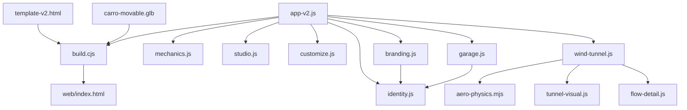
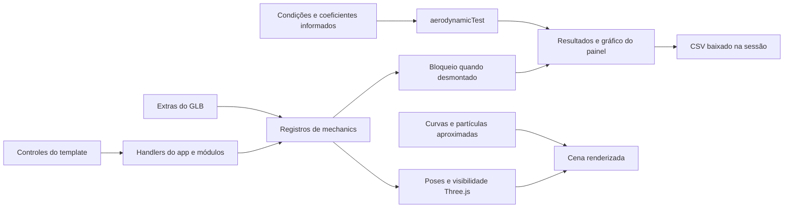
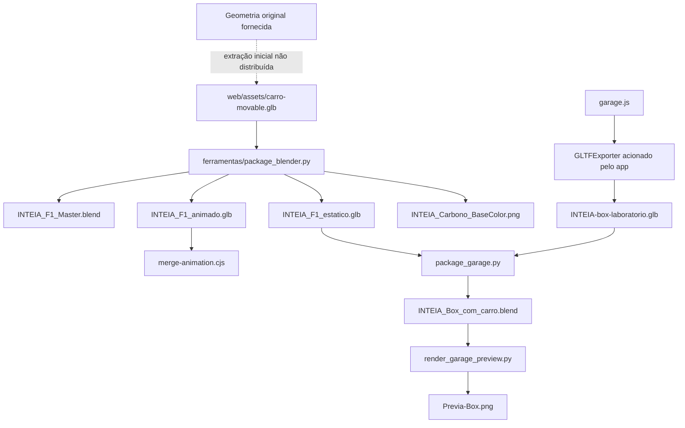

# Grafos, evidências e leitura estrutural

[Índice](README.md) · [Atlas interativo](index.html) · [Grafo completo](dados/grafo.json)

O atlas permite pesquisar todas as relações e abrir a vizinhança de um arquivo ou função. O desenho limita a quantidade de vizinhos para continuar legível; a lista de relações conserva todos os vínculos. Os grafos JSON são direcionais e permitem várias relações entre o mesmo par de nós. Não são reduzidos a um único vínculo por par.

| Recorte | Mermaid editável | Dados equivalentes |
|---|---|---|
| Importações da aplicação e ferramentas web | [arquitetura.mmd](grafos/arquitetura.mmd) | [arquitetura.json](grafos/arquitetura.json) |
| Dependências e produção de assets | [assets.mmd](grafos/assets.mmd) | [assets.json](grafos/assets.json) |
| Contratos DOM, geração, consumo e validação | [dados.mmd](grafos/dados.mmd) | [dados.json](grafos/dados.json) |

## Orientação de arquitetura

O diagrama abaixo é uma síntese editorial de relações presentes nos fontes. O conjunto completo, com caminhos e linhas, está nos arquivos acima e nas [80 relações curadas](dados/relacoes-curadas.json).

As setas `template/base/app → build → HTML` significam entrada/saída de produção; `app → módulo` significa importação. O JSON não mistura essas naturezas sem um atributo `relation` explícito.

## Dados na sessão

Este diagrama inclui estados transitórios, não somente arquivos. Ele é explicado no [mapa de módulos](MODULOS-E-FLUXOS.md), onde estão as evidências correspondentes. Os nós de resultados e cena não são fontes de coeficientes científicos da geometria.

## Produção e portabilidade

A relação tracejada é uma procedência declarada com etapa ausente, não uma conversão reproduzida. O download do exportador exige salvar o resultado no caminho usado pelo script Blender; não existe escrita automática no repositório pela página web.

## O que o graphify forneceu

Foi usado **graphify 0.9.41** sobre 21 fontes de código, em modo de extração estrutural com cache exclusivo desta tarefa. A detecção ampla encontrou 59 arquivos compatíveis (28 classificados como código, 22 documentos e 9 imagens), antes das adições concorrentes. O resultado bruto contém **97 nós e 166 relações**; o diagnóstico encontrou **51 relações com extremidades sem resolução** e um par com relações distintas que seria reduzido por um grafo simples. São limitações da extração, não evidências de falha do aplicativo.

O [AST bruto](dados/graphify-ast.json) e seu [diagnóstico](dados/graphify-execucao.json) foram preservados para auditoria. A extração ocorreu antes dos commits concorrentes de acabamento e ativação de branding.js: ela não substitui o índice de símbolos atualizado. Não se publicou esse AST como se fosse um grafo completo e íntegro. O mapa navegável usa arquivo real, importação conferida, símbolos extraídos por tree-sitter/Python AST e relações semânticas revisadas; ele valida destinos e não elimina relações distintas entre um par de nós.

Não foi feita uma nova clusterização semântica do corpus inteiro: a outra tarefa produz o grafo geral. Neste detalhamento, graphify é complemento de leitura, não autoridade exclusiva. A análise de documentos, scripts e imagens foi distribuída entre agentes conforme a skill. A extração AST não usou LLM; o total de tokens da leitura semântica não é fornecido pelas ferramentas, portanto o custo em tokens é **desconhecido**, não zero.

## Limites de inferência

- Referências a bibliotecas aparecem como `external:` e não expõem nem catalogam seu código instalado.
- Funções nomeadas têm escopo e linhas; chamadas JavaScript locais só são ligadas quando o nome resolve de forma unívoca no mesmo arquivo ou por importação nomeada. Métodos retornados por fábricas e callbacks exigem também a leitura curada.
- Evidência explícita de escrita de um arquivo comprova o contrato do script, não que os bytes atuais foram produzidos pela versão atual do script.
- Uma documentação mencionar um GLB é uma relação `documenta`, não uma dependência de execução.
- Os recortes em Mermaid são para leitura. O grafo completo JSON conserva origem, tipo, confiança e evidência de cada relação.
