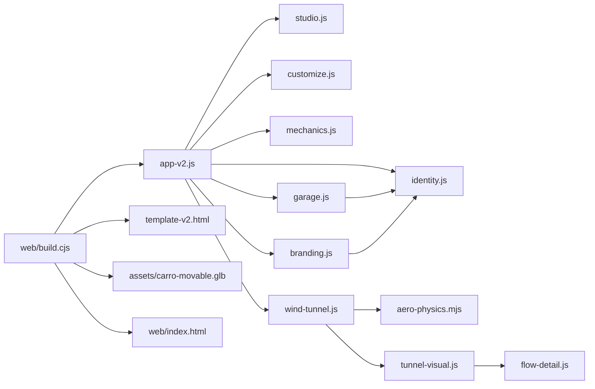
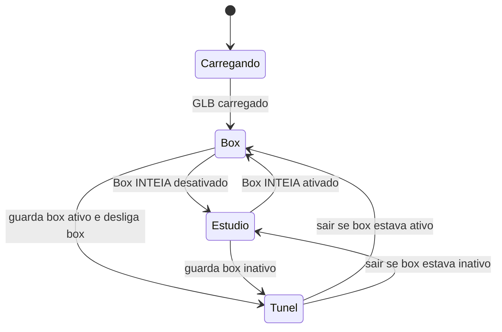
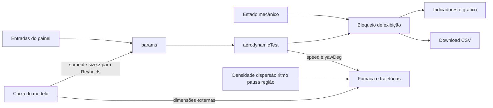

# Módulos, estados e fluxos verificados

[Voltar ao índice](README.md) · [Relações curadas em JSON](dados/relacoes-curadas.json)

Escopo: somente este repositório. Revisão final das fontes: **`e3d58af3c59a87b308444e678b0b25803e00e727`**, commit de 12/09/2026 às 22:30:52 (UTC−03). A coleta começou em `1ae4fd1`; os commits concorrentes `0346e58` (acabamento/iluminação) e `e3d58af` (assinatura lateral) foram incorporados à análise. Nenhum arquivo do aplicativo ou asset foi alterado por esta tarefa. O script de prévia final usa **64 amostras**; a cena Cycles do empacotador mantém **128**. A conferência local nesta revisão encontrou **14/14 hashes compatíveis** no manifesto. O horário e os hashes da última leitura estão na seção 15; referências de linha correspondem a essa revisão. Estado geral em [catálogo](dados/catalogo.json) e [conferência do manifesto](dados/manifesto-conferencia.json).

**Legenda:** comprovado significa que a relação está explícita no código/documento local. Isso não certifica a qualidade visual, a autoria da geometria original ou a validade física de um resultado. Uma interpretação estrutural sem chamada/caminho explícito é identificada como inferência. Esta página registra inspeção estática; testes executados pelo mapeamento e seus resultados ficam na validação geral do índice. Evidências históricas não são tratadas como testes novos.

## 1. Por onde começar no código

| Necessidade | Fonte editável | Função/contrato principal |
| --- | --- | --- |
| Compreender inicialização e integração | [app-v2.js](../../web/src/app-v2.js) | Entrada única do build; cria renderizador, cena, câmera, controladores, carrega modelo e conecta módulos/DOM. |
| Alterar estrutura da interface, textos e CSS | [template-v2.html](../../web/src/template-v2.html) | IDs e atributos esperados pelo JavaScript; CSS embutido; marcadores `__MODEL__` e `__APP__`. O arquivo está concentrado em três linhas extensas. |
| Montar, desmontar e manipular peças | [mechanics.js](../../web/src/mechanics.js) | `createMechanics(model)`, registros por componente, pivôs, `update` e API de estado. |
| Materiais, carbono, luz e piso | [studio.js](../../web/src/studio.js) | `setupStudio(THREE, renderer, scene)` e `applyCarMaterials(THREE, model)`. |
| Cor, acabamento e exposição | [customize.js](../../web/src/customize.js) | `setupCustomization(materials, studio, renderer, scene)`; exige os IDs do template. |
| Ambiente do box | [garage.js](../../web/src/garage.js) | `createGarage`, `setEnabled`, `update`, `getExportScene`; modelagem procedural e monitores. |
| Calculadora, painel, CSV e coordenação do túnel | [wind-tunnel.js](../../web/src/wind-tunnel.js) | `createWindTunnel`; `params`, `calculate`, `drawChart`; callbacks para o app. |
| Equações aerodinâmicas isoladas | [aero-physics.mjs](../../web/src/aero-physics.mjs) | `aerodynamicTest(entradas)`; função sem DOM/Three.js. |
| Câmara, luzes e fumaça | [tunnel-visual.js](../../web/src/tunnel-visual.js) | `createTunnelVisual`; shaders de partículas e restauração do ambiente. |
| Trajetórias, setas e regiões ilustrativas | [flow-detail.js](../../web/src/flow-detail.js) | `createFlowDetail`; curvas Catmull-Rom, pulsos e seleção por região. |
| Marca realmente aplicada | [identity.js](../../web/src/identity.js) | `glyphs`, `emblem`, `brandSVG`, `drawBrand`; interface e placa do box. |
| Assinatura INTEIA na lateral do carro | [branding.js](../../web/src/branding.js) | `applyInteiaBranding`, chamada no carregamento; projeta uma assinatura na lateral direita de `main_body` usando os paths de `identity.js`. |

## 2. Cadeia de importações e responsabilidade

Setas representam dependência de build/importação, não ordem temporal completa. `app-v2.js:1` importa `branding.js` e `app-v2.js:49` chama `applyInteiaBranding` após criar a mecânica. `branding.js:1,10` reutiliza os paths de `identity.js`; `:27` projeta uma assinatura na lateral direita da carroceria. A afirmação anterior de módulo fora da entrada deixou de valer em `e3d58af`. O [guia da identidade](../../identidade/LEIA-ME.md) ainda contém a frase histórica sobre carro sem propaganda; a assinatura própria do laboratório agora está implementada no Web, conforme o código atual.

Dependências externas de execução: **Three.js 0.180.0** e seus addons. `app-v2.js:3,8-15` usa `GLTFExporter`, `OrbitControls`, `TransformControls`, `EffectComposer`, `RenderPass`, `SSAOPass`, `OutputPass`, `SMAAPass` e `GLTFLoader`; `garage.js:1,4` usa `RectAreaLightUniformsLib` e `RoundedBoxGeometry`. `branding.js:3` usa `DecalGeometry` para a assinatura ativa do carro. O empacotamento usa **esbuild 0.25.10**, conforme [package.json](../../web/package.json). Não há framework de interface, banco de dados ou serviço remoto na cadeia de aplicação inspecionada.

## 3. Inicialização e ciclo de quadro

1. `app-v2.js:18-26` localiza `#stage`, consulta movimento reduzido, injeta a marca SVG, cria `WebGLRenderer` e adiciona seu canvas ao DOM. O canvas recebe foco por teclado e instruções acessíveis.
2. Cria uma `PerspectiveCamera` com campo de visão de 32°, estúdio e pós-processamento. O fluxo de qualidade alta é `RenderPass → SSAOPass → OutputPass → SMAAPass`. Modo leve chama `renderer.render` diretamente. O limite inicial de pixel ratio é `min(devicePixelRatio, 1.75)`.
3. `app-v2.js:41,46-49` observa o tamanho da área, decodifica o GLB em base64 de `#model-data`, interpreta com `GLTFLoader.parse`, centra o carro em X/Z e apoia sua caixa no piso em Y. Calcula `span` pelo maior tamanho X/Z e `focus` pela altura.
4. Aplica materiais, conecta personalização, cria mecânica, aplica a assinatura lateral, cria box e o ativa. Só então cria o túnel e seus callbacks. Essas fábricas compartilham a mesma cena, câmera e controlador mecânico; não são aplicativos independentes.
5. `app-v2.js:50-52` gera as opções de peças por categoria, informa quantidade e triângulos (incluindo a geometria de decalque criada no Web), habilita `[data-needs-model]` e registra `window.viewerInfo`. O rótulo de origem nesse objeto é uma indicação de procedência declarada, não uma verificação de licença.
6. `app-v2.js:83-84` usa `renderer.setAnimationLoop`: limita `dt` a 0,05 s, atualiza mecânica, interface, transição de câmera, travelling, `OrbitControls`, estúdio, box e túnel; decide visibilidade do piso, renderiza e publica FPS observado a cada aproximadamente dois segundos.

Falhas do carregamento atualizam `#loading`/`#status`; falhas de inicialização recomendam aceleração gráfica (`app-v2.js:53,85`). Não há armazenamento persistente de escolhas: o código inspecionado não usa `localStorage`, `sessionStorage` ou API de salvamento de configuração. O aviso da interface descreve alterações válidas na sessão.

## 4. Estado da aplicação e transições entre ambientes

| Estado | Dono | Efeito e dependências |
| --- | --- | --- |
| `model`, `mechanics`, `materials` | `app-v2.js:34,49` | Criados após GLB carregado; comandos do carro dependem deles. |
| `currentView`, `focus`, `distance`, `transition`, `autoFit` | `app-v2.js:34-44` | Controlam enquadramento e interpolação. `view` inclui folga para vista explodida; manipulação manual desativa ajuste automático. |
| `freeMove`, `gizmo` | `app-v2.js:26-27,43,67` | O gizmo se prende à raiz da peça selecionada. Arrastar bloqueia órbita e captura deslocamento em `mechanics.drag`. |
| `garage.enabled`, `garageWasActive` | `garage.js:147-151`, `app-v2.js:28,49` | Ao entrar no túnel, desliga o box e guarda se estava ativo; ao sair, restaura-o quando aplicável. |
| `tunnelActive`, `cinematic`, `cinemaTime` | `app-v2.js:29,49,80-84` | Travelling limitado ao túnel; arrastar câmera ou escolher vista interrompe. |
| `xraySaved` | `app-v2.js:30-32` | Guarda materiais originais ao explorar assoalho; cópias transparentes são descartadas ao restaurar. |
| `dark`, `photo`, `wind-active`, `garage-active` | classes do `body` no template/app | Ajustam layout e aparência. `photo` oculta painéis/auxílios; não é uma exportação do modelo. |
| `result`, `example`, `lastInvalid`, `visualSettings` | `wind-tunnel.js:11-19` | Separam resultados/entrada dos controles artísticos de densidade, dispersão, ritmo, pausa e região. |

`garage.setEnabled` guarda/restaura ambiente de reflexão, fundo, névoa, intensidade, piso e luzes do estúdio (`garage.js:149-150`). O túnel guarda/restaura intensidade, luzes, fundo, névoa e cor do piso (`tunnel-visual.js:67`). A coordenação de `app-v2.js:49` evita sobrepor box e túnel no fluxo normal. Tema/exposição/piso são recursos compartilhados; ao extrair esses módulos para outro app, preserve essa ordem de ativação/restauração ou adapte o dono desse estado.

## 5. Carro, metadados, montagem e seleção

### Contrato da geometria

`createMechanics` busca objetos com `userData.assemblyComponent`; na ausência deles, usa filhos diretos do modelo (`mechanics.js:4-6`). O registro de uma peça contém `id`, `root`, `source`, `label`, `category`, `center`, `size`, posição `base`, quaternion `rotation`, vetor `direction`, afastamento `manual`, `hidden` e deslocamento livre `custom` (`:28`). Os meshes recebem `userData.recordId` para seleção (`:29`).

A origem do nome segue `sourceObject → sourceName → name`; rótulo e categoria respeitam metadados existentes e só usam heurística como fallback (`:12-16`). As categorias são `body`, `aero`, `wheels`, `suspension`, `cockpit`, `details`. O ID numérico é a posição no array reconstruído em cada inicialização, portanto não é um identificador permanente entre arquivos diferentes. O [inventário de separação original](../../documentacao/componentes-origem.json) é um registro externo; não é importado pelo controlador em tempo de execução.

O controle não descobre engenharia interna pela malha. Escolhe conjuntos e direções por nomes e caixas delimitadoras. A aplicação informa ausência de motor, câmbio e mecanismos internos no rodapé de [template-v2.html](../../web/src/template-v2.html). A fonte geométrica é o [GLB derivado fornecido à aplicação](../../web/assets/carro-movable.glb); materiais, organização, controladores e cenários são contribuições separadas dessa geometria, conforme [procedência](../DIREITOS-E-PROCEDENCIA.md).

### Montagem e pivôs

| Função/trecho | Comportamento comprovado |
| --- | --- |
| `categoryFor`, cálculo de `direction` (`mechanics.js:8,17-27`) | Afastamentos artísticos por categoria/nome/lado. Rodas vão para os lados; asa dianteira para +Z; traseira para −Z; carroceria sobe. Não é sequência de desmontagem técnica. |
| Criação de rodas (`:32-39`) | Procura pneus dianteiros/traseiros por nome e sinal de X; cria pivô de direção e subpivô de giro. Pneus e coberturas externas entram no giro; coberturas internas acompanham direção sem o mesmo giro. |
| Criação de flap (`:40-42`) | Procura `rear_wing_drs` ou prefixo correspondente e estima pivô pela caixa da peça. |
| `apply` (`:43-54`) | Usa `smoothstep(amount, delay, 1)` com atrasos por categoria; combina `base + direction × (t + manual) + custom`; aplica isolamento/visibilidade. Não altera vértices. |
| `setAmount` e `update` (`:58,65`) | Alvo limitado entre 0 e 1; amortecimento `damp(...,4,dt)` e encaixe perto do alvo. Movimento reduzido aplica o alvo de montagem imediatamente. |
| `toggleLoop` e `update` (`:63,65`) | Alterna expansão/recomposição; troca fase depois da convergência e de pelo menos quatro segundos desde o início da fase. |
| `setSpin`, `setSteering`, `setDRS` (`:62`) | Giro ilustrativo; direção em Y nos pivôs dianteiros; DRS em X. Graus da interface são convertidos para radianos. |
| `drag` (`:56`) | Ao começar, interrompe loop/giro e zera direção/DRS. Ao terminar, guarda a diferença de posição em `custom`; não persiste em disco. |
| `restoreParts` / `reset` (`:57,64`) | Restauram deslocamentos/quaternions; `reset` também zera estado de movimentos, seleção e flags. A atualização seguinte recompõe a cena. |

`motionAvailable` exige montagem abaixo de 0,001 e ausência de deslocamentos manuais/livres. **Não inclui isolamento em sua própria condição** (`:55`); o túnel acrescenta isolamento separadamente ao bloqueio de forças. `apply` anula visualmente direção/giro/DRS quando há peças deslocadas. Não existem simulação de suspensão, contato pneu/pista, Ackermann, massas, colisores ou rig físico no controlador inspecionado.

### Seleção e navegação

`select`, `refreshSelection` e `focusPart` (`app-v2.js:42-44`) atualizam painel, caixa de destaque, seletor, isolamento e gizmo; foco usa a caixa da peça e a direção de câmera vigente. O raycast (`app-v2.js:76-78`) só seleciona quando deslocamento entre pointerdown/up não passa de 5 px, o gizmo não está usando eixo e a cadeia de ancestrais da interseção está visível. A lista de peças é uma alternativa DOM ao clique na malha. O código não filtra a lista por texto; o catálogo pesquisável desta documentação é uma função separada do app.

## 6. Contratos da interface: eventos e seletores

Todos os IDs abaixo existem em [template-v2.html](../../web/src/template-v2.html). São relações explícitas entre arquivo JavaScript e template, também registradas no [JSON](dados/relacoes-curadas.json). Ao reutilizar uma fábrica com DOM, mantenha esse contrato ou substitua-o por referências explícitas a elementos.

| Grupo de elementos | Evento | Dono e consequência |
| --- | --- | --- |
| `[data-view]`, `#orbit`, `#zoom-in`, `#zoom-out`, `#reset` | click | App: vistas hero/lateral/frente/traseira/superior/inferior, órbita, distância e restauração. |
| `#assembly`, `#assemble`, `#explode`, `#loop` | input/click | App → mecânica: alvo de montagem, restauração das peças e repetição. |
| `#part-select`, `#clear-selection`, `#focus-part`, `#isolate` | change/click | App → seleção/foco/isolamento; atualiza `#selected-name`, `#selected-category`, `#offset-value`. |
| `#free-move`, `#part-offset` | click/input | App → gizmo/`setManual`. A posição livre é guardada em `custom` ao encerrar arraste. |
| `#spin`, `#steering`, `#drs` | click/input | App → giro, direção ±22° e DRS 0–32°; limites vêm do template e não são certificação mecânica. |
| `#color-body`, `#color-wings`, `#color-wheels`, `#color-carbon`, `[data-paint]`, `#paint-finish` | input/click/change | `customize.js`: cores por grupos de nome e acabamento por tabela; presets disparam input nos seletores. |
| `#theme`, `#light-level`, `#floor-color`, `#background-color`, `#reset-style` | click/input | App altera tema; personalização sincroniza exposição e controles de cor. Restaurar estilo não restaura montagem. |
| `#wire`, `#quality`, `#photo`, `#save-photo` | click | App: aramado, pós-processamento, modo visual e PNG. |
| `#garage-toggle`, `#garage-view`, `#garage-export` | click | App/box: alterna ambiente, amplia vista, exporta somente o box. `garage.js` também escreve o estado do botão. |
| `#wind-toggle`, `#wind-cinema` | click | Túnel/app: ambiente e travelling; travelling não calcula forças. |
| `#smoke-density`, `#smoke-turbulence`, `#smoke-tempo`, `#smoke-pause` | input/click | Túnel → parâmetros artísticos; pausa congela o tempo da fumaça e dos pulsos. |
| `#flow-detail`, `#flow-region` | click/change | Túnel → visibilidade/região e callback para transparência/foco no app. |
| `#air-speed`, `#air-headwind`, `#air-crosswind`, `#air-temp`, `#air-pressure`, `#air-area`, `#air-cd`, `#air-cl` | input | Túnel → `params` → `aerodynamicTest` → indicadores, gráfico e validade. |
| `#air-example`, `#air-reset`, `#air-export` | click | Túnel: exemplo explicitamente hipotético, limpeza e CSV. |
| `#steering-value`, `#drs-value` | leitura pelo box | `garage.js:60` lê os textos que o app atualiza, para o monitor de configuração. Esse acoplamento ao DOM precisa ser substituído caso o box seja extraído sozinho. |

O canvas aceita Home (vista inicial), Escape (limpar seleção), +/− (zoom) e setas (câmera), em `app-v2.js:79`. `ResizeObserver` chama `resize`; `OrbitControls` emite `start` para interromper travelling/transição; `TransformControls` emite `dragging-changed` para bloquear órbita durante arraste. A preferência de movimento reduzido elimina transição de câmera e avanço de fumaça/pulsos/travelling; o giro de rodas e a órbita acionados pelo usuário não recebem o mesmo bloqueio explícito. Portanto não se deve descrever toda a aplicação como completamente imóvel sob essa preferência sem teste adicional.

## 7. Materiais, texturas, iluminação e câmeras

`studio.js:2-72` configura saída sRGB, ACES Filmic, exposição inicial 0,88, sombras VSM, key/fill/hemisphere e piso. O ambiente de reflexão é produzido em memória por `PMREMGenerator.fromScene` a partir de uma sala e painéis luminosos procedurais. Não há arquivo HDR externo nessa função. `setTheme` altera fundo/névoa/piso, intensidade e exposição; `update` do estúdio está vazio, e `dispose` existe, mas a aplicação não o chama durante seu ciclo normal.

`applyCarMaterials` (`studio.js:146-251`) conserva um cache por UUID de material original, copia propriedades Standard para `MeshPhysicalMaterial` e troca acabamento conforme nome. Assim, dois meshes que compartilham material continuam compartilhando a substituição. Pintura (`pintura*`) recebe vermelho/verniz sem mapa de patrocinador; `carbon*` recebe textura e rugosidade procedurais; `pneus`/`borracha` usam ruído; `rodas`, `aço`, `mirror` e `vidro` têm ajustes específicos. Os meshes passam a emitir/receber sombras. Mudanças de nomes podem impedir classificação correta sem apresentar erro explícito. A revisão `0346e58` em `studio.js:190-221` limpa também normal/bump/roughness/metalness/AO herdados da pintura; usa pintura com rugosidade 0,21 e verniz 0,065, carbono com rugosidade 0,43/verniz 0,35 e borracha com rugosidade 0,72. Aço recebe metalness 1 e rugosidade 0,25 (`:229-233`). Essas são escolhas de aparência do projeto, sem calibração colorimétrica/fotométrica declarada.

O carbono do navegador é produzido em canvas de 256×256 com gerador pseudoaleatório de semente fixa. `applyLocalCarbonProjection` (`:104-144`) injeta GLSL em `onBeforeCompile`: amostra em três planos do espaço local, levando escala em conta. Isso acompanha desmontagem/rotação sem reescrever os UVs fornecidos. Não é escaneamento de carbono real. A [textura PNG portátil](../../texturas/INTEIA_Carbono_BaseColor.png) é gerada pelo fluxo Blender, não carregada por `studio.js`; materiais de GLB/Blender e shader Web são implementações diferentes. Um exportador glTF não transporta automaticamente JavaScript `onBeforeCompile`.

`customize.js:4-10` agrupa pintura de carroceria/asas, rodas e carbono pelo nome, e captura os valores originais. A revisão `0346e58` sincronizou o acabamento brilhante com rugosidade 0,21 e rugosidade de verniz 0,065. `reset-style` assume ao menos um material em cada grupo (`:48`); outro GLB deve atender esse contrato ou adaptar a função. As escolhas não são serializadas. A luz do controle de interface é multiplicador de exposição do renderizador, não uma medição de intensidade luminosa física.

O box gera sua própria reflexão PMREM clonando o cenário (`garage.js:145-146`); o túnel acrescenta suas luzes e reaproveita recursos da cena/estúdio (`tunnel-visual.js:19-25,67`). Na revisão `0346e58`, `garage.js:138-146` inicializa `RectAreaLightUniformsLib`, cria duas luzes retangulares, reduz key/fill/hemisphere, desativa emissão de sombra pelas estruturas de teto e desloca a cópia do cenário usada no reflexo em −0,75 no eixo Y. Isso aproxima o ponto de captura do reflexo da altura do carro; a cena visível não é deslocada. Paredes e teto são ocultados conforme posição da câmera; isso serve à leitura visual. A câmera do navegador não é a câmera Cycles do pacote Blender, criada em [package_garage.py](../../ferramentas/package_garage.py).

## 8. Box INTEIA e marca

`garage.js` constrói um grupo `INTEIA development garage` por primitivas (`box`, `cylinder`, `tube`, `label`) e texturas canvas (`grain`, `screen`). Os blocos incluem arquitetura/piso, armários, bancada de engenharia, teclados e cadeiras, carrinho/ferramentas, pneus de reserva, macaco, serviços suspensos, armazenamento e estruturas. São geometrias do cenário criadas pelo código do projeto; não derivam da malha do carro. Comentários da fonte e [BOX-LABORATORIO.md](../BOX-LABORATORIO.md) declaram inspiração em referências públicas, não réplica dimensional de um box específico.

O monitor `setup` lê `mechanics.records.length`, `1 - mechanics.amount`, direção e DRS; atualiza aproximadamente a cada segundo enquanto box ativo (`garage.js:60,64,151`). O painel `plan` é uma lista fixa de etapas. Os demais exibem ausência de ensaio/telemetria (`:61-63`). Não existe integração com telemetria de pista.

`identity.js` compartilha desenho de letras e emblema entre `brandSVG` (cabeçalho, chamado em `app-v2.js:19`) e `drawBrand` (canvas da placa, `garage.js:37`). As seis letras estão em paths, com I/A finais em vermelho; o texto auxiliar usa Arial. Os [SVGs de identidade](../../identidade/LEIA-ME.md) são arquivos reutilizáveis documentados; nenhum deles é baixado em tempo de execução pelo app. O JSON de relações diferencia essa documentação explícita de uma suposta leitura de SVG que não acontece.

`applyInteiaBranding` (`branding.js:6-29`) desenha os mesmos `glyphs` em canvas 1536×320, todos em branco aproximado `#f5f5f2`, com inclinação de 12°. A função interna `project` procura `record.source === main_body`, faz raycast do lado +X, cria `DecalGeometry`, converte-a ao espaço local do mesh atingido e anexa o decalque como filho. O novo mesh recebe `recordId` da carroceria, acompanhando seleção e desmontagem. Há uma chamada de projeção (`:27`), largura 0,76 e profundidade 0,22; falha de nome/raycast/geometria vazia encerra sem decalque. `document.body.dataset.inteiaDecals` registra a quantidade realmente criada (`:28`). Isso acrescenta geometria de assinatura ao modelo carregado em memória; não altera o GLB-base, os GLBs do carro, o master Blender nem o GLB exportado do box. O retorno inclui `dispose`, mas o app não guarda/chama esse retorno no fluxo normal.

`getExportScene` clona **só o grupo do box** e força descendentes visíveis (`garage.js:148`). `GLTFExporter.parseAsync` exporta esse clone com `binary:true, onlyVisible:false` (`app-v2.js:56`). O navegador gera download `INTEIA-box-laboratorio.glb`; não escreve automaticamente [ambientes/INTEIA-box-laboratorio.glb](../../ambientes/INTEIA-box-laboratorio.glb). A colocação do download nessa pasta é uma etapa operacional entre fluxos, documentada no guia, não uma chamada de escrita na aplicação. O reflexo PMREM externo ao grupo e a atualização dos monitores não acompanham o GLB; telas exportadas são imagens do instante da exportação. A revisão `0346e58` acrescentou luzes `RectAreaLight`, que também não são transportadas pelo GLB conforme [ACABAMENTO-E-RENDER.md](../ACABAMENTO-E-RENDER.md). O export continua útil para geometrias/materiais/telas, mas o destino precisa reconstruir iluminação compatível.

## 9. Túnel: equações, bloqueios e desenho do fluxo

### Cálculo por coeficientes

`aerodynamicTest` é independente de geometria/renderização. Valida números de condição finitos, temperatura acima do zero absoluto, pressão e comprimento positivos; converte km/h para m/s. Calcula densidade com ar ideal seco, pressão dinâmica, Reynolds com viscosidade de Sutherland e Mach com velocidade do som ideal (`aero-physics.mjs:3-9`). Os coeficientes não são inferidos da malha.

| Entrada/resultado | Relação implementada |
| --- | --- |
| Velocidade axial | `(speedKmh + headwindKmh) / 3.6` |
| Velocidade lateral / módulo | `crosswindKmh / 3.6`; `hypot(axial,lateral)` |
| Densidade / pressão dinâmica | `pressureKPa*1000 / (287.05*(temperatureC+273.15))`; `q = 0.5*rho*speed²` |
| Forças | `drag = q*cd*area`; `downforce = q*clDown*area`; nulas sem coeficientes finitos, área > 0 e coeficientes ≥ 0. |
| Potência | `airPower = drag*speed`; potência dissipada no ar relativo, não potência de motor. |
| Componentes de arrasto | Projeção de arrasto nos eixos axial e lateral; não são modelo separado de força lateral/yaw. |
| Validade incompressível | `withinIncompressibleRange = mach < 0.3`. A função ainda retorna números de força quando fora da faixa; **o bloqueio de exibição/exportação pertence a wind-tunnel.js**. |

`wind-tunnel.js:19` fornece `size.z` da caixa do carro como comprimento, assumindo a orientação/escala do asset atual. Não calcula área projetada do GLB. `calculate` (`:21-38`) bloqueia apresentação de forças e exportação se houver montagem/target > 0,001, movimento indisponível, isolamento, coeficientes ausentes ou Mach fora da faixa. DRS/direção/giro visuais não recalibram Cd/C↓. O exemplo (`:50`) preenche A=1,5, Cd=0,9, C↓=3,0 e marca origem hipotética; editar coeficiente/área troca a identificação para usuário não validado.

`drawChart` (`:39-48`) calcula 61 pontos de velocidade do carro, 0–300 km/h em passos de 5, mantendo vento e demais parâmetros. CSV (`:53-57`) calcula 31 linhas de 0–300 em passos de 10, inclui cabeçalhos de origem/condições e deixa forças vazias fora da faixa Mach. O gráfico não reutiliza valores medidos e não é série temporal; é uma varredura paramétrica. Consulte [AERODINAMICA.md](../AERODINAMICA.md) para fundamentos e limites declarados.

### Desenho artístico

`tunnel-visual.js:30-60` cria 7.200 pontos com semente fixa. Shaders deslocam cinco faixas em torno de um envelope analítico, ampliam dispersão na esteira e calculam transparência/ruído. `density` controla opacidade; `turbulence` altera a forma artística de dispersão; `tempo` controla avanço temporal. Não há pressão local, malha volumétrica, integração de Navier–Stokes, camada limite ou validação CFD.

`flow-detail.js:9-32` constrói **19 trajetórias** pelo código: 9 de carroceria, 6 espirais atrás das rodas e 4 sob o assoalho. Essa contagem é extraída dos limites dos loops, não contagem de linhas de corrente físicas. Cada curva recebe duas setas fixas, 8 pacotes e caudas de 7 segmentos (`:33-43`). Cores distinguem região: azul, âmbar e verde; não codificam pressão/velocidade medidas. A malha detalhada não é consultada para resolver caminhos: curvas dependem apenas de `size`.

`visual.update` gira o grupo pelo yaw e usa velocidade relativa para ritmo, mas a trajetória continua pré-definida. Fluxo desaparece com velocidade zero ou carro inválido; pausa/movimento reduzido param o avanço de tempo. Selecionar uma região reduz fumaça de fundo. Selecionar assoalho ativa cópias transparentes dos materiais no app e oculta estruturas superiores para legibilidade. Todas são convenções visuais. As [revisões do túnel](../REVISAO-TUNEL-VISUAL.md) contêm avaliações históricas subjetivas; sua aprovação visual não valida física nem desempenho geral.

Não existe seta da forma de cada peça para Cd/C↓. Qualquer reutilização em aula/site deve preservar a distinção entre calculadora física por coeficientes e desenho ilustrativo de escoamento.

## 10. Build, servidor e saídas

| Arquivo/ação | Entrada real | Saída/efeito |
| --- | --- | --- |
| [build.cjs](../../web/build.cjs):2-4 | `src/app-v2.js`, importações, template e `assets/carro-movable.glb` | esbuild gera IIFE minificada em memória; GLB vira base64; substitui marcadores e **sobrescreve `web/index.html`**. Caminhos relativos exigem contexto `web`. |
| [server.cjs](../../web/server.cjs):1-5 | Arquivos dentro de `web` (`__dirname`) | Servidor HTTP de arquivos, bind `127.0.0.1`; porta padrão 5186 ou `PORT`. `/` serve `index.html`; tipos explícitos HTML/JS/GLB/PNG. Não é servidor de produção. |
| `#save-photo` (`app-v2.js:75`) | Render atual, temporariamente sem caixa/gizmo | Download `INTEIA-design-3D.png`; imagem, sem dados editáveis do carro. |
| `#garage-export` (`app-v2.js:56`) | Clone de `garage.root` | Download GLB do box e materiais/telas exportáveis; sem carro e sem controlador. |
| `#air-export` (`wind-tunnel.js:53-57`) | Condições e coeficientes permitidos | Download CSV de varredura matemática, com origem hipotética/não validada. |

`web/index.html` é artefato gerado e versionado para uso imediato; mudanças permanentes devem começar em `web/src`/asset e passar pelo build. O build não reconstrói `.blend`, GLBs de `modelos`, prévias nem manifesto. A aplicação atual não exporta o carro personalizado como GLB, não salva a sessão e não exporta o túnel como Blender/vídeo.

**Limite operacional desta tarefa:** `localhost:5186` já serve a pasta `outputs` de outra conversa. Isso não prova que esteja servindo `web/index.html` deste repositório. O servidor não foi interrompido/trocado para este mapeamento. Para teste novo, escolher outra porta explicitamente e verificar o conteúdo servido. A revisão local de [DESENVOLVIMENTO.md](../DESENVOLVIMENTO.md) agora também manda preservar o processo existente e selecionar outra porta.

Como todos os comandos desta tarefa devem manter cwd na raiz específica do projeto, a instalação/build documentados podem ser acionados com `npm --prefix web ci` e `npm --prefix web run build`; o npm executa o script no contexto do pacote. **Esses comandos são instruções de manutenção, não ações realizadas nesta página.** O build altera o HTML; não o executar apenas para produzir um mapa de leitura.

## 11. Produção e validação de assets fora do navegador

| Script | Relações comprovadas no código | Limite para reutilizar |
| --- | --- | --- |
| [package_blender.py](../../ferramentas/package_blender.py) | Lê `web/assets/carro-movable.glb` (`:9`); escreve carbono PNG (`:44`), GLBs estático/animado (`:126-127`), master (`:145`), prévia (`:146`) e `validacao-criacao.json` (`:148`). | Reconstrução a partir da base, não preservação da pilha do tutorial nem de edições manuais posteriores do master. Estúdio criado após exports fica fora dos GLBs do carro. |
| [merge-animation.cjs](../../ferramentas/merge-animation.cjs) | Lê e reescreve `modelos/INTEIA_F1_animado.glb`; agrega samplers/channels num único clipe chamado `INTEIA_Demonstracao_Montagem_Rodas_DRS` (`:1-4`). | Mutação do GLB, não export novo nem validação de movimento. |
| [validate-kit.py](../../ferramentas/validate-kit.py) | Reabre master (`:5`), inspeciona montagem e reimporta ambos GLBs (`:15-22`), escreve `validacao-reabertura.json` (`:25`). | Valida condições programadas; não testa todos os motores de jogo nem fidelidade física. |
| [package_garage.py](../../ferramentas/package_garage.py) | Lê GLB do box (`:6`) e carro estático (`:12`), separa coleções, cria cena Cycles/câmera/luz; escreve blend e `ambientes/validacao-box.json` (`:72-75`). | Recebe raiz após `--`; telas continuam estáticas; não incorpora a animação do carro. |
| [render_garage_preview.py](../../ferramentas/render_garage_preview.py) | Abre `ambientes/INTEIA_Box_com_carro.blend` (`:4`); renderiza `ambientes/Previa-Box.png` (`:5-6`). | Fonte atual configura 64 amostras com denoise, 1600×1000 e seis threads; não equivale ao render Web. Não se infere que a imagem já tenha sido regenerada só porque o script mudou. |
| [manifest.cjs](../../ferramentas/manifest.cjs) | Lê lista explícita de 14 artefatos e escreve `manifesto-sha256.json` (`:1`). | Manifesto não cobre cada fonte/documento do repositório. Hash confirma bytes; não prova licença, qualidade ou sincronismo conceitual de todas as fontes. |

A revisão `0346e58` de `package_garage.py:30-68` remove ligações herdadas de pintura, cria microtextura de pneus e bevel de sombreamento em metais, substitui luzes importadas por fontes de área, usa Cycles 128 amostras/adaptação/denoise e câmera de 30 mm. A energia final das fontes é 180 nos softboxes e 140 nas faixas laterais, com exposição −0,65. São mudanças no script e no fluxo do box; não demonstram que master/carros de `modelos` foram refeitos. O guia [ACABAMENTO-E-RENDER.md](../ACABAMENTO-E-RENDER.md) documenta essa separação.

O navegador usa `mechanics.js`, sem `AnimationMixer` na entrada inspecionada. A animação exportada e a animação JavaScript são dois controladores diferentes sobre geometria relacionada. O [guia de integração](../INTEGRACAO.md) proíbe aplicar ambos simultaneamente às mesmas peças. A [arquitetura anterior](../ARQUITETURA.md) identifica `web/src` como fonte do visualizador e alerta que reconstruir o master a partir do GLB sobrescreve edições manuais.

## 12. Testes existentes e o que de fato cobrem

| Teste | Evidência e alcance | Efeito colateral / lacunas |
| --- | --- | --- |
| [test-mechanics.mjs](../../web/test-mechanics.mjs) | Lê o GLB real, remove imagens/materiais apenas da cópia em memória, carrega geometria, verifica 97 registros/4 rodas/DRS, vinte ciclos sem deriva de matriz acima de 1e-6, offsets, restauração, coberturas internas, isolamento e arraste livre. | **Escreve `validacao-mecanica-web.json` na raiz** (`:23`). Não mede texturas/luzes, pixel output, física real ou acessibilidade; remover materiais na cópia evita dependência de imagens/DOM. |
| [test-aerodynamics.mjs](../../web/test-aerodynamics.mjs) | Testa densidade aproximada, km/h→m/s, escala V²/V³, cancelamento por vento de cauda, vento lateral, coeficientes ausentes/negativos, limite Mach, temperatura/pressão inválidas. | Apenas imprime resultado; não testa DOM, gráfico/CSV, fumaça, CFD, nem coeficientes reais do carro. |
| [validate-kit.py](../../ferramentas/validate-kit.py) | Reabertura Blender, movimento no frame 90, recomposição no 210, imagens externas e reimportação dos GLBs. | Requer Blender e atualiza relatório. Valores históricos estão nos JSONs locais; qualquer edição posterior exige nova execução. |

`npm --prefix web test` roda os dois testes em sequência e herda a escrita do teste mecânico. Para manter um mapeamento estritamente documental, é necessário isolar a saída ou registrar explicitamente essa mudança; não tratar `npm test` como operação sem escrita. [VALIDACAO.md](../VALIDACAO.md) e [REVISAO-TUNEL-VISUAL.md](../REVISAO-TUNEL-VISUAL.md) descrevem inspeções passadas; não substituem browser QA da revisão atual. Não há suíte automatizada de navegação/pixels no pacote de testes inspecionado.

## 13. Reutilização por módulo: requisitos e limites concretos

| Destino | Caminho inicial | Preparação necessária |
| --- | --- | --- |
| Incorporar experiência pronta num site | [web/index.html](../../web/index.html) | Abrir/servir HTML gerado; verificar WebGL, tamanho/download e política de scripts do site hospedeiro. O kit atual incorpora o GLB no HTML; cache separado e carregamento progressivo exigem implementação. |
| Usar apenas o controlador de peças no Three.js | [mechanics.js](../../web/src/mechanics.js) + [carro-movable.glb](../../web/assets/carro-movable.glb) | Instalar versão compatível de Three.js, carregar modelo, preservar nomes/extras/orientação e chamar `update(dt, nowMs, reduced)`; criar UI própria. Não acionar clipe GLB simultaneamente. |
| Reaproveitar visual do carbono | [studio.js](../../web/src/studio.js) | Ambiente de browser/canvas e pipeline de materiais compatível; manter hooks de shader ou converter para textura/UV do destino. Nomes de materiais guiam upgrades. |
| Reaproveitar personalização | [customize.js](../../web/src/customize.js) + [template](../../web/src/template-v2.html) | Reproduzir IDs e grupos de material existentes, ou desacoplar DOM; o código assume todos os grupos presentes ao restaurar. Implementar persistência se necessária. |
| Colocar box procedural em outro site | [garage.js](../../web/src/garage.js) + [identity.js](../../web/src/identity.js) | Three.js, renderer, camera, studio e mechanics; adaptar `#steering-value`, `#drs-value`, `#garage-toggle` e gestão de fundo/luzes. |
| Usar somente o cenário em jogo/Blender | [GLB do box](../../ambientes/INTEIA-box-laboratorio.glb) ou [blend conjunto](../../ambientes/INTEIA_Box_com_carro.blend) | Reconfigurar reflexão/luzes; telas são estáticas. A lógica de ocultar paredes e os monitores dinâmicos não são importados com o GLB. |
| Reaproveitar calculadora matemática | [aero-physics.mjs](../../web/src/aero-physics.mjs) | Entradas documentadas/unidades SI e origem dos coeficientes; preservar o bloqueio incompressível que a função apenas sinaliza. Não apresentar como cálculo de CFD. |
| Reaproveitar túnel visual | [wind-tunnel.js](../../web/src/wind-tunnel.js), [tunnel-visual.js](../../web/src/tunnel-visual.js), [flow-detail.js](../../web/src/flow-detail.js) | Adaptar DOM/callbacks, cena e dimensões do carro; a câmara e diversos emissores usam medidas fixas. Trocar GLB não ajusta automaticamente todas as dimensões nem calcula fluxo pela malha. |
| Importar carro animado em outro renderizador | [INTEIA_F1_animado.glb](../../modelos/INTEIA_F1_animado.glb) | Usar controlador de animação do destino; em Three.js, mixer e clipe conforme [integração](../INTEGRACAO.md). Não há validação de Unity/Unreal/Godot registrada. |
| Editar modelo/coleções no Blender | [INTEIA_F1_Master.blend](../../INTEIA_F1_Master.blend) | Seguir [BLENDER.md](../BLENDER.md), preservar cópia de edições manuais antes de reconstrução. GLB usa Y para cima; Blender Z; conferir escala/eixos uma só vez. |

Código e documentação: MIT. Para reutilização dos modelos sob os termos atuais, mantenha somente a marca/patrocínio **INTEIA visível e legível na própria peça**; os demais patrocínios podem ser removidos ou trocados. Uso, adaptação, redistribuição e uso comercial continuam permitidos. Consulte a licença de modelos `ASSET-LICENSE.txt` na raiz do repositório. As permissões MIT/CC BY 4.0 já concedidas às versões anteriores permanecem válidas.

## 14. Como atualizar esta página e as relações

1. Registrar `git rev-parse HEAD` e `git status --short` na raiz específica do projeto; identificar alterações concorrentes antes de gerar documentação.
2. Reler importações em `web/src`, contratos de seletores no template e entradas/saídas dos scripts. Buscar símbolos ativos e módulos sem consumidores; arquivo existente não comprova execução.
3. Atualizar diagramas e esta página a partir dos trechos atuais. Números de linha devem refletir a nova revisão; separar novamente cálculos, estados, visualização e saídas.
4. Atualizar `dados/relacoes-curadas.json`: cada endpoint precisa ser arquivo real repo-relativo; cada evidência deve apontar para arquivo/linha existente. Relação extraída pode usar `confidence_score: 1.0` somente quando explícita; não promover inferência visual a relação técnica comprovada.
5. Executar o processo de validação de referências/cobertura descrito no [índice](README.md). Validar links sem editar o aplicativo, reconstruir assets ou iniciar/encerrar o serviço de outra conversa.
6. Se forem necessários testes de execução, registrar o que foi realmente executado, saída, revisão e eventuais arquivos atualizados. Inspeção de fonte, build bem-sucedido, reimportação Blender e teste visual são evidências diferentes.

Os dados estruturados complementam importações automáticas com contratos DOM, leitura/escrita de artefatos, consumidores de testes e relações explicitamente documentadas. Downloads são eventos de runtime descritos nesta página; não viram endpoints fictícios no JSON. Um mesmo nome de download e arquivo versionado não demonstra que a revisão versionada tenha sido gerada a partir do código atual.

## 15. Assinaturas da leitura de fontes

Coleta final desta página: `2026-09-12T22:37:19-03:00`; revisão `e3d58af3c59a87b308444e678b0b25803e00e727`. Hashes SHA-256 dos bytes locais efetivamente relidos. Servem para detectar alterações posteriores; a conferência de fontes é separada da compatibilidade de artefatos do manifesto. A coleta inicial de 22:20 foi substituída por esta tabela final após os commits de acabamento e assinatura.

| Fonte | SHA-256 |
| --- | --- |
| `docs/ACABAMENTO-E-RENDER.md` | `7cdca7247e347b980121da20332add33deeba9cc69b5ab1a7d08813b00143447` |
| `ferramentas/manifest.cjs` | `31241fb26f341af10fdcd8d0ebd92ac2772ac12438035bed5bc5fa1c32f1659c` |
| `ferramentas/merge-animation.cjs` | `8870463d9db1c8daa8c4646331e8af726e45963f4840b6d91b8937a450890b2f` |
| `ferramentas/package_blender.py` | `6a8bfa4ca77b5dbe8db20b9fca5c2ba1a5d1fbf819dee4808eb316b95b4a0d6a` |
| `ferramentas/package_garage.py` | `db9da9c72d2121c7722520405910d5be7f099888b948c09cb6de9651e38dcf9c` |
| `ferramentas/render_garage_preview.py` | `2943c2fab0e646463e2cd0e8a6bf8a0a2ac8227a82ae18f7b1e7a657d46aae64` |
| `ferramentas/validate-kit.py` | `51b3d24db0fe5bc8ec123f269f27907066f1cfb4d1cf13f379807be3bd55c4a9` |
| `web/build.cjs` | `b4195fe57f892d1fe85d1595d0f1c9ce3ae77d356648b52c537ee3ab2904e2fe` |
| `web/package.json` | `6801c80839109117eb1d7f6abeff097e4cff3548e7571bb7cee88c2e8be77a48` |
| `web/server.cjs` | `2ef0a47dc1ee0a4673aa4c31e213f1043b984406d13688345014eecd1f284f6e` |
| `web/src/aero-physics.mjs` | `ddec76df50dd3dba23d2361d5579be999d70a4a1bd58dce99001fd4b9c146482` |
| `web/src/app-v2.js` | `7064534fb4a7e6f5c7070a2dbc32d161bf8744fd1b547c1369f920ee70d35977` |
| `web/src/branding.js` | `84d47397f7255884a41f3273c493746b6b74de0d789cfc55052edd1b8671380b` |
| `web/src/customize.js` | `9588784fd0e68d0dd4d61ad3c2731ef39c1cba33f6f57f47b172d55abc0a4176` |
| `web/src/flow-detail.js` | `436414a7e85b9ad8a043c469412b63224dc101e4caba06e76340977d85684f1a` |
| `web/src/garage.js` | `881afa322c3ed23315549e48147df9f1f47e31836ed29cc24730538bbd91ced4` |
| `web/src/identity.js` | `f7da18ffada2006737675abb026d621097f8219e37587a5b72c1dfc798b089a6` |
| `web/src/mechanics.js` | `e6795bbc6ccccca32f2c4582cae3fab14d798ff3d7d0a31b23d59ecc5b1735eb` |
| `web/src/studio.js` | `36ca53b97600bcdcec404b67ab42333afefe20c00d046d2c92d28145f6b6d8e1` |
| `web/src/template-v2.html` | `eb68c53ef7656791d9b8e4a2555be50fa5e5f91d22ccdc22e24d9c8a49b51dc7` |
| `web/src/tunnel-visual.js` | `46435c35174bd737c548b964d23a577214f26c645459bf8f4d792b183ffd02c5` |
| `web/src/wind-tunnel.js` | `7795a0a4bf6a3462b7c9c81d20431b26e133041a8930dcda8ee2191bfd9556e5` |
| `web/test-aerodynamics.mjs` | `a18952d5f54a4917f9fa14d546c55401d9fa57e13d559dea0bc9f7549c32bce8` |
| `web/test-mechanics.mjs` | `d54f8929104e5ba8ee76479607b00313789c0e6b84af41d025b33df031ac9ba8` |
