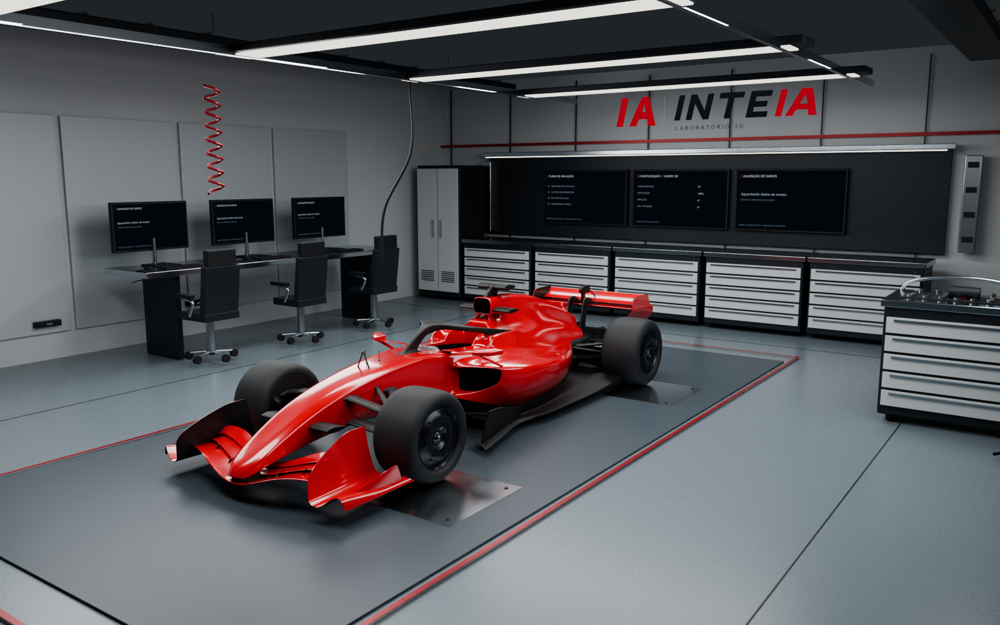
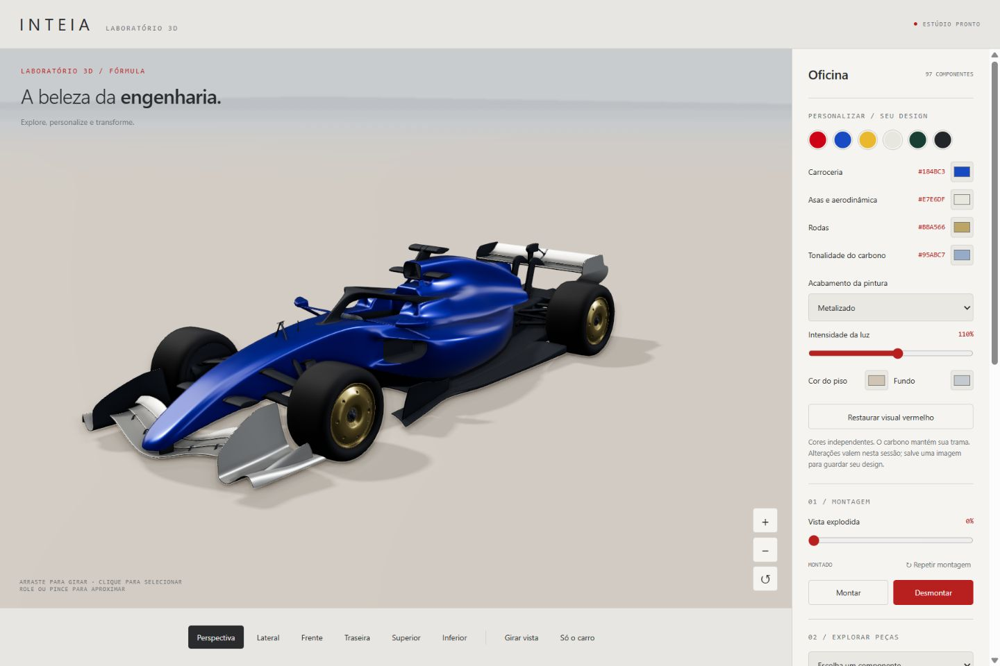
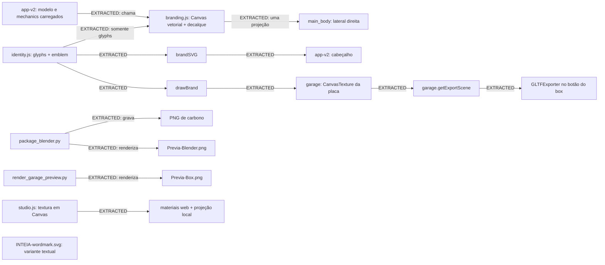

# Assets visuais e identidade INTEIA

[README do projeto](../../README.md) · [Guia da identidade](../../identidade/LEIA-ME.md) · [Procedência](../DIREITOS-E-PROCEDENCIA.md)

Este levantamento inspeciona os quatro arquivos raster soltos, os cinco SVGs e a apresentação HTML da identidade. As imagens foram abertas e observadas; suas dimensões e formatos foram lidos dos arquivos. A revisão de referência final é **`e3d58af3c59a87b308444e678b0b25803e00e727`**. Os módulos `app-v2.js`, `branding.js` e `identity.js` foram relidos em **12/09/2026 às 22:36:12, UTC−03:00** e seus hashes estão registrados ao final. A marca está ativa no carro pela entrada da aplicação. A inspeção visual da prévia do box permanece a de **22:29:00 do mesmo dia**, com 1600 × 1000 pixels; uma mudança posterior no código web não atualiza automaticamente esse render Blender. A análise deste documento não reexecutou render, exportação, build ou testes e não modificou assets.

## Navegação

- [Inventário raster e inspeção visual](#inventário-raster-e-inspeção-visual)
- [Vetores e apresentação da identidade](#vetores-e-apresentação-da-identidade)
- [Relações verificadas com o aplicativo](#relações-verificadas-com-o-aplicativo)
- [Fontes, derivados e limites de evidência](#fontes-derivados-e-limites-de-evidência)
- [Reutilização prática](#reutilização-prática)
- [Atualização e conferência](#atualização-e-conferência)

## Inventário raster e inspeção visual

| Arquivo | Dimensões reais | Formato real / tamanho | Finalidade e natureza |
|---|---:|---|---|
| [Previa-Blender.png](../../Previa-Blender.png) | 960 × 640 | PNG / 695.174 bytes | Imagem de apresentação do carro em estúdio; saída de render declarada por `package_blender.py`; usada no README. Derivado raster, não fonte de geometria. |
| [ambientes/Previa-Box.png](../../ambientes/Previa-Box.png) | 1600 × 1000 | PNG / 2.189.120 bytes | Prévia atual do box com o carro; saída declarada por `render_garage_preview.py`. Derivado raster, reinspecionado em 12/09/2026 às 22:29:00 UTC−03:00. |
| [documentacao/INTEIA-personalizacao.png](../../documentacao/INTEIA-personalizacao.png) | 1440 × 960 | **JPEG/JFIF**, apesar da extensão `.png` / 83.329 bytes | Registro visual de uma tela de personalização. Derivado raster; o mecanismo e a data exata de captura não foram localizados nas fontes consultadas. |
| [texturas/INTEIA_Carbono_BaseColor.png](../../texturas/INTEIA_Carbono_BaseColor.png) | 256 × 256 | PNG / 4.840 bytes | Textura procedural de cor do carbono para Blender/glTF, produzida por `package_blender.py`. É uma entrada de material no pacote de destino, embora seja derivada de código. |

A identificação do terceiro arquivo foi confirmada por cabeçalho `FF D8 FF E0 … JFIF` e pelo decodificador de imagem. Os três PNGs verdadeiros começam com `89 50 4E 47 0D 0A 1A 0A`. O nome foi preservado. Ferramentas que inferem o formato apenas pela extensão podem classificá-lo incorretamente; a extensão deve ser registrada separadamente do formato decodificado em qualquer catálogo.

### Carro em estúdio

O quadro mostra um monoposto vermelho em perspectiva elevada de três quartos, com a dianteira voltada para a região inferior esquerda. São visíveis asas dianteira e traseira, cockpit, pneus escuros, partes do assoalho e reflexos largos e claros sobre a carroceria. O piso e o fundo são cinza; há sombra de contato sob o conjunto. Não há interface de controles nem logotipo legível sobre o carro nesse enquadramento.

[package_blender.py](../../ferramentas/package_blender.py), linhas 137–146, configura câmera com lente de 48 mm, Cycles com 16 amostras e denoising, resolução 960 × 640, transformação de visualização AgX e o caminho desta prévia. A coincidência de caminho e dimensões comprova o contrato de geração existente no código. Sem reexecutar o render, não se afirma que os bytes atuais foram necessariamente produzidos pela revisão atual desse script.

Esta imagem não comprova número total de peças, movimentação das rodas, funcionamento do DRS, topologia oculta, precisão dimensional ou comportamento físico dos materiais. Reflexos e sombras observáveis são evidência de aparência neste enquadramento.

### Box com o carro

O quadro atual mostra o carro vermelho dentro de um ambiente de oficina: piso cinza com demarcações vermelhas e placas metálicas sob as rodas, armários e gavetas, monitores de fundo escuro, mesas e cadeiras à esquerda, luminárias retangulares no teto, cabeamento e parte do carrinho de ferramentas na borda direita. A placa ao fundo apresenta o monograma IA em vermelho, o nome INTEIA com o final vermelho e a descrição pequena Laboratório 3D. Em comparação com a imagem da primeira inspeção, o carro ocupa mais do quadro, o enquadramento é mais baixo e fechado e o armazenamento de pneus antes visível à direita fica fora do recorte. A carroceria mantém reflexos brancos largos e concentrados; isso descreve a aparência, sem estabelecer melhoria física ou certificação de realismo.

Na imagem maior, alguns títulos dos monitores e “Aguardando dados de ensaio” são legíveis; não se transcrevem todos os valores como se tivessem sido medidos. A explicação de seu conteúdo vem de [garage.js](../../web/src/garage.js), função interna `screen`: o painel `setup` usa estado do visualizador; `plan` apresenta uma lista de avaliação; `data` escreve “Aguardando dados de ensaio” e “Nenhuma telemetria conectada”. A existência de monitores na imagem não demonstra dados de pista.

[render_garage_preview.py](../../ferramentas/render_garage_preview.py), linhas 4–6 da versão relida, abre [INTEIA_Box_com_carro.blend](../../ambientes/INTEIA_Box_com_carro.blend) e configura **64 amostras, denoising, seis threads e 1600 × 1000** antes de gravar a prévia. O script não salva novamente o `.blend`. O empacotador [package_garage.py](../../ferramentas/package_garage.py), linhas 56–68 da versão relida, configura a cena Blender com **128 amostras**, denoising, câmera de 30 mm e resolução 1600 × 1000. Portanto, o número de amostras definido no empacotador não deve ser atribuído à receita da prévia.

Essa receita atual do empacotador também altera acabamento da pintura, adiciona ruído e bump à borracha e bevel de sombreamento a certos materiais metálicos, remove luzes importadas e cria fontes de área. Isso está explícito nas linhas 24–65; não constitui validação das propriedades físicas sugeridas pelos nomes dos nós ou comentários. A inspeção da imagem não substitui a comparação dos materiais dentro do arquivo Blender.

**Registro anterior, substituído no inventário atual:** a primeira inspeção abriu uma prévia de 1000 × 625, com 898.443 bytes e SHA-256 `df596074204b1e506c492d1ae18bc59c4d93bc98b285e4316fac74666f5a78a8`; o renderizador então consultado definia 16 amostras. O mesmo caminho agora contém a imagem maior. O hash antigo permanece apenas como evidência da inspeção anterior, não como identificação do arquivo atual. Na releitura, a data de modificação informada pelo sistema de arquivos foi `2026-09-13T01:28:59.5520185Z`; isso não é, sozinho, prova do instante ou comando exato de renderização.

### Registro da personalização

O quadro mostra uma interface clara com o carro azul, asas claras, rodas douradas e pneus escuros. À direita há o painel “Oficina”, indicação de “97 componentes”, seletores de cores, acabamento “Metalizado”, intensidade da luz em 110%, opções de piso e fundo e controles de montagem em 0%. A faixa inferior contém opções de câmera. Isso documenta os textos e o estado visível da captura, sem validar a contagem por inspeção da imagem ou a operação dos botões.

O cabeçalho da captura usa o nome simples, espaçado, sem o monograma IA à esquerda e sem o tratamento vetorial inclinado da identidade atual. Em [app-v2.js](../../web/src/app-v2.js), o cabeçalho atual é preenchido por `brandSVG()`. Portanto, a captura não representa fielmente a assinatura atualmente definida em código. Não foi inferida uma data ou sequência de versões a partir dessa diferença.

Os controles visíveis têm correspondência temática com [customize.js](../../web/src/customize.js): grupos `body`, `wings`, `wheels`, `carbon`, opções de acabamento, exposição, piso e fundo. A correspondência é **INFERRED**, pois não há registro de captura vinculando este arquivo a uma revisão específica. A imagem por si só não é teste funcional nem prova de persistência das escolhas.

### Textura de carbono

O arquivo mostra uma pequena trama escura, repetitiva e diagonal, com variações suaves entre os feixes. É uma textura de superfície isolada, sem carro, iluminação de cena ou interface. Não é fotografia de uma amostra física nem mapa medido de propriedades mecânicas.

[package_blender.py](../../ferramentas/package_blender.py), linhas 35–51, calcula os pixels, grava o PNG, empacota a imagem no Blender e a conecta ao `Base Color` dos materiais cujo nome contém `carbon`. As linhas 61–67 atribuem UVs planares às faces correspondentes. A produção procedural é comprovada pelo código; não foi deduzida somente pela aparência da trama.

O carbono web é outro caminho: [studio.js](../../web/src/studio.js) cria `CanvasTexture` em memória e usa `applyLocalCarbonProjection` para amostrar três planos no shader. O módulo não carrega este PNG. Os algoritmos partilham a ideia da trama, mas o web acrescenta perturbação determinística aos pixels, constrói mapas separados de cor e rugosidade e usa projeção distinta. Igualdade visual ou equivalência física entre web e Blender não foi demonstrada.

## Vetores e apresentação da identidade

| Arquivo editável | `viewBox` | Características verificadas no conteúdo |
|---|---|---|
| [INTEIA-principal.svg](../../identidade/INTEIA-principal.svg) | `0 0 640 116` | Monograma vermelho; separador vertical; nome em seis caminhos vetoriais, com inclinação `skewX(-12)`; `INTE` grafite e `IA` vermelho; descrição Laboratório 3D em Arial. |
| [INTEIA-negativo.svg](../../identidade/INTEIA-negativo.svg) | `0 0 640 116` | Mesma composição; o grafite do nome, do separador e da descrição é substituído por branco gelo; mantém vermelho no monograma e nas duas letras finais. Não incorpora fundo escuro. |
| [INTEIA-monocromatico.svg](../../identidade/INTEIA-monocromatico.svg) | `0 0 640 116` | Mesma composição inteira em grafite. O separador mantém opacidade `.22`; uma única cor nominal não significa opacidade uniforme. |
| [INTEIA-simbolo.svg](../../identidade/INTEIA-simbolo.svg) | `-8 0 136 96` | Apenas o monograma IA vermelho, sem nome completo, separador ou descrição. |
| [web/assets/INTEIA-wordmark.svg](../../web/assets/INTEIA-wordmark.svg) | `0 0 1000 250` | Palavra INTEIA branca em um elemento `<text>`, Arial/sans-serif, peso 700, centralizada. Não contém monograma, descrição, caminhos das letras ou inclinação de 12 graus. É uma variante diferente. |

Esses valores são coordenadas de `viewBox`, não dimensões raster. Os SVGs não declaram largura e altura intrínsecas em pixels. Na assinatura completa, apenas o nome está em curvas; a descrição continua dependente de fonte. No `wordmark.svg`, todo o nome depende da fonte disponível. A variante negativa e o wordmark branco precisam de um fundo que permita contraste para serem observados.

[Identidade-INTEIA.html](../../identidade/Identidade-INTEIA.html) é uma apresentação independente com CSS e SVGs embutidos. Inclui assinatura negativa sobre fundo grafite, assinatura principal, símbolo compacto, paleta `#D92135`, `#202930`, `#F0F2F3` e o texto “Precisão · Inteligência artificial · Movimento”. Por conter cópias embutidas, não carrega os SVGs irmãos nem importa `identity.js`: alterar um deles não atualiza automaticamente a apresentação.

[identidade/LEIA-ME.md](../../identidade/LEIA-ME.md) prescreve manutenção da proporção, margem equivalente à altura da letra I, ausência de sombras/contornos/gradientes adicionados e largura mínima de 220 px para a assinatura completa quando a descrição precisar ser legível. Para espaços menores, indica o símbolo. As cores da pintura e da interface não são automaticamente a paleta da marca.

## Relações verificadas com o aplicativo

As classes seguem a distinção usada no levantamento Graphify: **EXTRACTED** é uma relação explícita em código ou documento; **INFERRED** é uma interpretação identificada; **AMBIGUOUS** indica elo insuficientemente demonstrado. Atribuir uma função como fonte do desenho não demonstra, sozinho, quando cada arquivo de entrega foi exportado.

| Origem → destino | Classe | Evidência e consequência |
|---|---|---|
| `identity.js: brandSVG` → cabeçalho de `app-v2.js` | EXTRACTED | `app-v2.js` importa a função e atribui seu retorno ao `innerHTML` de `brand-logo`. Não usa o wordmark branco externo nesse caminho. |
| `identity.js: drawBrand` → placa de `garage.js` | EXTRACTED | `garage.js`, linhas 36–38, desenha em Canvas 2048 × 400, cria `CanvasTexture` e aplica a um plano 3D de 3,7 × 0,723, nomeado `INTEIA identity`. |
| `identity.js: glyphs/emblem` → `brandSVG` e `drawBrand` | EXTRACTED | Ambas as funções usam as mesmas definições de caminhos para o nome e o monograma. A versão Canvas redesenha a descrição com métricas de fonte e espaçamento manual. |
| `identity.js` ↔ SVGs principal, negativo e símbolo | EXTRACTED para o desenho compartilhado | Os caminhos das letras, o monograma e as transformações são os mesmos. Não foi localizado um script versionado responsável por regravar automaticamente os SVGs. |
| `Identidade-INTEIA.html` ↔ SVGs da identidade | EXTRACTED para o conteúdo duplicado | O HTML embute as composições negativa, principal e compacta. É uma entrega separada e deve ser conferida quando a marca mudar. |
| `studio.js: setupStudio` → cena e renderizador web | EXTRACTED | Define ACES, exposição, sombras VSM, ambiente PMREM, luzes, piso e troca de tema. É chamado pela entrada `app-v2.js`. |
| `studio.js: applyCarMaterials` → materiais do carro web | EXTRACTED | Troca materiais a partir dos nomes do asset: pintura, carbono, pneus, borracha, rodas, aço, espelho e vidro. A entrada chama a função depois de carregar o modelo. |
| `identity.js: glyphs` → `branding.js: applyInteiaBranding` | EXTRACTED | `branding.js`, linhas 1 e 7–10, importa os caminhos das seis letras e os desenha por `Path2D` num Canvas de 1536 × 320, com inclinação de 12 graus e cor uniforme `#f5f5f2`. O nome do decalque não depende de Arial nem carrega `INTEIA-wordmark.svg`; também não inclui monograma ou descrição. |
| `branding.js: applyInteiaBranding` → assinatura lateral no carro | EXTRACTED | A linha 27 faz uma única tentativa de projeção por `DecalGeometry`, na lateral direita de `main_body`, a partir do lado positivo de X. O decalque fica ligado à malha atingida e usa `recordId`. A função pode produzir zero ou um decalque, pois retorna sem criar geometria se faltar o registro ou a interseção; não se confunde a tentativa em código com uma execução validada. |
| Entrada atual → `branding.js` | EXTRACTED, relação ativa | `app-v2.js` importa `applyInteiaBranding` na linha 1 e chama `applyInteiaBranding(model,mechanics)` na linha 49, depois de `createMechanics(model)` e antes de `createGarage`. O módulo integra o fluxo atual de carregamento do carro. |
| `INTEIA-personalizacao.png` → uma revisão específica da interface | AMBIGUOUS | A imagem se parece com o visualizador e seus controles, mas não contém metadado de revisão verificado nem caminho de captura localizado. |

No grafo, `branding.js` está ligado à entrada ativa e compartilha as letras vetoriais de `identity.js`; apenas `INTEIA-wordmark.svg` permanece sem ligação demonstrada a esse fluxo. O cabeçalho e a placa usam a assinatura completa; o decalque no carro usa somente as seis letras, todas claras. A exportação do box clona sua cena e é acionada por `app-v2.js`; ela não constitui uma exportação das interações HTML ou das funções JavaScript.

O trecho do guia de identidade que afirma que o carro permanece sem propaganda não descreve integralmente o estado web desta revisão: há agora uma assinatura INTEIA aplicada pelo código. As prévias Blender e a captura de personalização continuam sendo evidências dos arquivos raster identificados por seus próprios hashes, sem comprovar a presença ou funcionamento desse novo decalque no navegador.

## Fontes, derivados e limites de evidência

Os documentos [DIREITOS-E-PROCEDENCIA.md](../DIREITOS-E-PROCEDENCIA.md) e [THIRD-PARTY-NOTICES.md](../../THIRD-PARTY-NOTICES.md) registram a origem da geometria no arquivo `F1_2026_tutorial_part7_textures.blend`, fornecido pelo usuário e ausente deste repositório. A base derivada disponível está em [web/assets/carro-movable.glb](../../web/assets/carro-movable.glb). Esta é uma declaração documental de procedência, não identificação do autor original pela aparência.

A marca, os ajustes de materiais, o ambiente e o código do laboratório são contribuições diferenciadas da geometria recebida. Aplicar identidade INTEIA, repintar ou criar uma prévia não transforma a geometria de origem em criação original INTEIA. A atribuição de originalidade da identidade é a declaração dos arquivos locais; não se realizou investigação externa de exclusividade ou marca registrada.

O código de `garage.js` descreve o box como ambiente original inspirado em garagens publicamente visíveis. A inspeção mostra os elementos cenográficos descritos, mas não comprova réplica de uma equipe ou especificação de engenharia. Nenhum dos quatro rasters mostra ensaio aerodinâmico ou campo de fluxo medido. Eles não sustentam CFD validada, fidelidade física, certificação mecânica, precisão colorimétrica oficial ou equivalência a fotografia.

[historico-avaliacoes.md](../../documentacao/historico-avaliacoes.md) registra notas subjetivas e limitações de borracha, reflexos e carbono. Essas notas são histórico de avaliação visual e não medição física. O nome “Precisão” na apresentação da identidade é parte de seu texto de marca, não um resultado de validação científica.

## Reutilização prática

| Destino | Caminho concreto | Pré-requisitos e limites |
|---|---|---|
| Imagem de apresentação em um site ou documento | Prévia de [estúdio](../../Previa-Blender.png) ou [box](../../ambientes/Previa-Box.png) | Usar como imagem estática com descrição alternativa; preservar proporção. Não permite trocar peças ou câmera. Verificar autorização de uso conforme os documentos do projeto. |
| Identidade em site com fundo claro/escuro | [principal](../../identidade/INTEIA-principal.svg) / [negativo](../../identidade/INTEIA-negativo.svg) | Inserir como imagem ou SVG, preservando `viewBox`; para arquivo externo, fornecer `alt`. Em espaços pequenos, preferir [símbolo](../../identidade/INTEIA-simbolo.svg). A descrição depende de Arial/sans-serif. |
| Identidade gerada na aplicação | [identity.js](../../web/src/identity.js), `brandSVG()` ou `drawBrand(ctx,w,h)` | JavaScript em módulos; para Canvas, navegador com contexto 2D e `Path2D`. Não requer carregar o wordmark SVG. Comparar também as cópias estáticas após mudanças. |
| Material de carbono no Blender ou motor de jogos | [PNG de carbono](../../texturas/INTEIA_Carbono_BaseColor.png), [master Blender](../../INTEIA_F1_Master.blend) ou [GLB estático](../../modelos/INTEIA_F1_estatico.glb) | O PNG é mapa de cor; precisa de coordenadas de textura, repetição, material e iluminação. Não traz sozinho normal, colisão ou propriedades estruturais. O master/GLB já reúne mais contexto do material. |
| Aparência e iluminação web | [studio.js](../../web/src/studio.js) | Three.js e renderer/scene compatíveis; `applyCarMaterials` depende dos nomes de material da base e do ambiente DOM para Canvas. O shader local de carbono não se transfere automaticamente para um motor de jogos ou Blender. |
| Box com identidade em Blender | [INTEIA_Box_com_carro.blend](../../ambientes/INTEIA_Box_com_carro.blend) | Abrir no Blender e conferir imagens empacotadas, materiais e iluminação. A marca no plano 3D é textura, não as letras vetoriais editáveis do SVG. Para outro desenho, substituir/regerar a textura ou usar os SVGs como fonte de um novo asset. |
| Assinatura do carro em outro visualizador web | [branding.js](../../web/src/branding.js) e seu import de `identity.js` | Exige `glyphs`, Canvas 2D/`Path2D`, modelo e `mechanics.records` com `source`, `root` e `id`, além de Three.js/DecalGeometry. Chamar após criar `mechanics`, como na entrada atual. O único ponto de projeção é específico da lateral direita desta geometria; conferir a interseção no destino. O resultado contém o nome em curvas, sem monograma ou descrição. |

Os conteúdos originais de INTEIA / Igor Morais Vasconcelos estão disponíveis sob licença MIT: qualquer pessoa pode usar, copiar, modificar, redistribuir e utilizar comercialmente, preservando o aviso de copyright e a licença. Não é necessário pedir autorização adicional. Esta concessão inclui código, documentação e geometria original, inclusive seus arquivos exportados. Materiais de terceiros conservam suas próprias licenças; o motor V6 já publicado em CC BY 4.0 mantém essa opção de uso. Conforme declaração de autoria de Igor Morais Vasconcelos em 21/09/2026, o vídeo foi usado como referência para as funções das peças; a modelagem disponibilizada é de sua autoria. A carroceria, suas versões GLB, o master Blender e os demais modelos autorais estão incluídos na licença MIT, com permissão de uso, modificação, redistribuição e uso comercial.

## Atualização e conferência

1. Anotar o `HEAD` e o estado de trabalho antes de atualizar o mapa; preservar os trabalhos concorrentes.
2. Enumerar novamente os quatro caminhos raster e os cinco SVGs; registrar extensão e formato real separadamente. Ler dimensões pelo decodificador de imagem, especialmente para `INTEIA-personalizacao.png`.
3. Reabrir as imagens após qualquer mudança de bytes. Registrar o que efetivamente é visível e conferir se as capturas ainda representam a identidade atual.
4. Conferir os caminhos em `glyphs`, `emblem`, `brandSVG` e `drawBrand` contra os SVGs e as cópias embutidas de `Identidade-INTEIA.html`. A composição está duplicada; não existe sincronização automática demonstrada.
5. Buscar importações/chamadas de `identity.js`, `branding.js`, `setupStudio`, `applyCarMaterials` e referências ao wordmark; revisar a classificação de ativo ou apenas disponível.
6. Conferir scripts de render e de material sem presumir que os derivados foram regenerados. Se uma tarefa futura regenerar os arquivos, comparar dimensões e o novo render antes de substituir as evidências.
7. Validar os links relativos deste documento e comparar hashes com o estado de inventário. O [manifesto](../../manifesto-sha256.json) cobre os três PNGs verdadeiros e os quatro SVGs de `identidade`, mas não inclui a captura de personalização, o wordmark SVG ou a apresentação HTML; não usá-lo como cobertura total dos visuais.

Hashes SHA-256 observados para rastrear as quatro imagens inspecionadas:

| Caminho | SHA-256 |
|---|---|
| `Previa-Blender.png` | `661a7d173d357509ced9c4a111d566031f735fe346430b807238d5d8b9ec8335` |
| `ambientes/Previa-Box.png` | `e8a0c313dc2ff2a59dd592b10588ad538454a946c7c72a6d46a20bba4837958b` |
| `documentacao/INTEIA-personalizacao.png` | `a781a771df9f4b7d3b991538a99b48a9d568d1f9d3e1085bb5cbc6e008848ace` |
| `texturas/INTEIA_Carbono_BaseColor.png` | `e0b9e969eeed3c6f4fb6d599384879da202201780182372d6a031d307340fd8b` |

Hashes SHA-256 dos módulos relidos em 12/09/2026 às 22:36:12 UTC−03:00:

| Caminho | Bytes | SHA-256 |
|---|---:|---|
| `web/src/branding.js` | 2.177 | `84d47397f7255884a41f3273c493746b6b74de0d789cfc55052edd1b8671380b` |
| `web/src/identity.js` | 2.245 | `f7da18ffada2006737675abb026d621097f8219e37587a5b72c1dfc798b089a6` |
| `web/src/app-v2.js` | 19.000 | `7064534fb4a7e6f5c7070a2dbc32d161bf8744fd1b547c1369f920ee70d35977` |

Cobertura: quatro arquivos raster observados visualmente; cinco SVGs e um HTML de identidade lidos; relações confrontadas com os módulos e scripts citados. Imagens embutidas dentro de GLB/Blender, texturas criadas em memória, rasterizações da aplicação e outros derivados têm seus caminhos de produção identificados, mas não foram individualmente renderizados neste recorte.

Validação desta entrega: os 45 links relativos para arquivos, correspondentes a 30 destinos únicos, resolveram para caminhos existentes; os quatro hashes das imagens e os três hashes dos módulos corresponderam aos arquivos consultados. Os links internos da navegação seguem os títulos deste documento.
